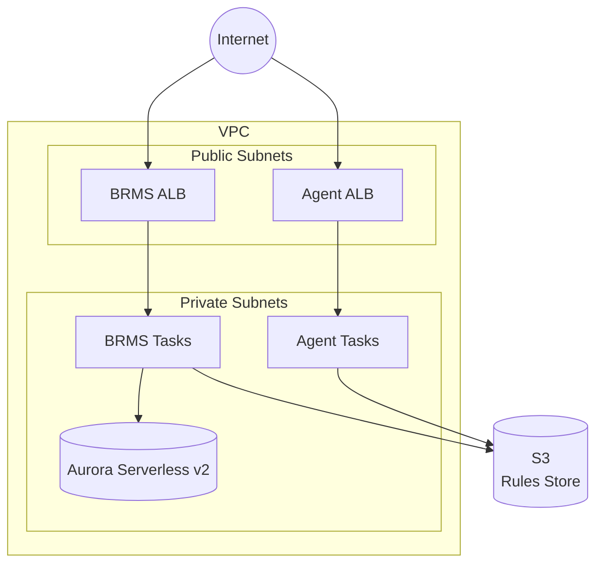

# GoRules Terraform Modules - AWS

Terraform modules for deploying GoRules on AWS ECS Fargate.

> [!WARNING]
> **BRMS Requires HTTPS**
>
> The BRMS frontend uses browser APIs (Web Crypto API, Service Workers) that only work in secure contexts. **Without HTTPS, BRMS will display a blank page.** You must configure a custom domain with an SSL certificate before deploying BRMS. See the [full-stack example](examples/full-stack/) for detailed setup instructions.

## Architecture



## Deployment Patterns

| Pattern    | Components                 | Use Case                        |
| ---------- | -------------------------- | ------------------------------- |
| Full Stack | BRMS + Agent + Aurora + S3 | New deployments, development    |
| Agent Only | Agent + S3                 | Production workloads, stateless |
| BRMS Only  | BRMS + Aurora + S3         | Management UI, rule editing     |

## HTTPS Configuration

### BRMS (HTTPS Required)

BRMS requires HTTPS to function properly. You must provide:
- `domain` - Your custom domain name (required)
- One of the following certificate options:
  - `route53_zone_id` - Automatically creates and validates an ACM certificate
  - `certificate_arn` - Use an existing validated ACM certificate

**Option 1: Automatic certificate with Route53 (recommended)**
```hcl
brms = {
  domain          = "brms.example.com"
  route53_zone_id = "Z1234567890ABC"  # Your Route53 hosted zone ID
  # ... other settings
}
```

**Option 2: Existing ACM certificate**
```hcl
brms = {
  domain          = "brms.example.com"
  certificate_arn = "arn:aws:acm:us-east-1:123456789012:certificate/..."
  # ... other settings
}
```

### Agent (HTTPS Optional)

Agent can run HTTP-only or with HTTPS:

**HTTP-only (no domain)**
```hcl
agent = {
  # No domain specified - runs on ALB DNS with HTTP
  allowed_cidr_blocks = ["10.0.0.0/8"]
  # ... other settings
}
```

**HTTPS with custom domain**
```hcl
agent = {
  domain          = "agent.example.com"
  route53_zone_id = "Z1234567890ABC"  # or certificate_arn
  # ... other settings
}
```

## IAM Database Authentication

When using `database.auth = "iam"`, a Lambda function creates PostgreSQL users
for IAM authentication. This Lambda runs in your VPC and needs to access
AWS Secrets Manager to retrieve master database credentials.

**Network requirement (one of):**
1. **NAT Gateway** - Default when using this module's VPC
2. **Secrets Manager VPC Endpoint** - Set `vpc.enable_vpc_endpoints = true`

Note: This requirement only applies to IAM auth. The default `secrets` auth
mode uses ECS secrets injection, which doesn't require VPC connectivity.

## Security Features

- **SSL Enforcement**: Database connections require SSL via cluster parameter group (`rds.force_ssl = 1`)
- **ALB Deletion Protection**: Enabled by default for both BRMS and Agent ALBs (configurable via `alb_deletion_protection`)
- **CloudWatch Alarms**: CPU, memory, 5xx errors, and unhealthy targets monitoring with optional SNS notifications
- **Secrets Encryption**: BRMS secrets are encrypted using configurable providers (see below)

## BRMS Secrets Provider

BRMS requires a secrets provider for encrypting sensitive data stored in rules. The module supports two providers:

> [!CAUTION]
> **Do Not Delete Encryption Keys**
>
> The master key (env provider) or KMS key (aws-kms provider) is used to encrypt all BRMS secrets. If deleted or changed, **all encrypted secrets become permanently unrecoverable**. Ensure proper backup and access controls for these critical resources.

### Environment Variable Provider (Default)

Uses a master key stored in Secrets Manager. Simple setup, suitable for most deployments.

```hcl
brms = {
  # ... other settings
  secrets_provider = {
    type              = "env"        # Default
    master_key_length = 64           # Min 32 characters
  }
}
```

### AWS KMS Provider

Uses AWS KMS for encryption. Recommended for enterprise deployments requiring centralized key management.

**Create new KMS key:**
```hcl
brms = {
  # ... other settings
  secrets_provider = {
    type          = "aws-kms"
    kms_key_alias = "gorules-brms-secrets"  # Optional alias
  }
}
```

**Use existing KMS key:**
```hcl
brms = {
  # ... other settings
  secrets_provider = {
    type           = "aws-kms"
    create_kms_key = false
    kms_key_arn    = "arn:aws:kms:us-east-1:123456789012:key/..."
  }
}
```

## AI/LLM Configuration

BRMS has an optional AI assistant that helps users build and edit rules. To enable it, configure the `brms.ai` block with your LLM provider.

Supported providers: `openai`, `anthropic`, `google`, `amazon-bedrock`, `azure-openai`

See the [GoRules AI setup guide](https://docs.gorules.io/developers/deployment/brms/ai-setup) for details on how the AI assistant works within BRMS.

**Anthropic (Claude)**
```hcl
brms = {
  # ... other settings
  ai = {
    provider           = "anthropic"
    model              = "claude-sonnet-4-6"
    api_key_secret_arn = "arn:aws:secretsmanager:us-east-1:123456789012:secret:anthropic-api-key-AbCdEf"
  }
}
```

**Amazon Bedrock**

Bedrock uses IAM for authentication — no API key needed. The module automatically creates the required `bedrock:InvokeModel` IAM policy scoped to the specified model. Use inference profile IDs with a geographic prefix (e.g., `us.`, `eu.`, `apac.`).

```hcl
brms = {
  # ... other settings
  ai = {
    provider = "amazon-bedrock"
    model    = "us.anthropic.claude-sonnet-4-6-20250514-v1:0"
  }
}
```

**Azure OpenAI**

Requires the `azure_resource_name` of your Azure OpenAI deployment.

```hcl
brms = {
  # ... other settings
  ai = {
    provider            = "azure-openai"
    model               = "gpt-4o"
    api_key_secret_arn  = "arn:aws:secretsmanager:us-east-1:123456789012:secret:azure-openai-key-AbCdEf"
    azure_resource_name = "my-openai-resource"
  }
}
```

| Parameter | Default | Description |
|-----------|---------|-------------|
| `provider` | — | LLM provider (required) |
| `model` | — | Model name or inference profile ID (required). For amazon-bedrock, use inference profile IDs with a geographic prefix. |
| `api_key_secret_arn` | `null` | Secrets Manager ARN for the API key (required for all providers except amazon-bedrock) |
| `temperature` | `0.4` | Sampling temperature (0–2) |
| `max_output_tokens` | `32000` | Maximum output tokens |
| `thinking_level` | `"medium"` | Thinking level: `high`, `medium` |
| `context_window` | `null` | Override context window size |
| `azure_resource_name` | `null` | Azure OpenAI resource name (required for azure-openai) |

## Examples

- [Full Stack](examples/full-stack/)
- [Agent Only](examples/agent-only/)
- [Existing VPC](examples/existing-vpc/)
- [Multi-Environment](examples/multi-environment/)

## Requirements

| Name      | Version |
| --------- | ------- |
| terraform | >= 1.14 |
| aws       | >= 6.0  |
| random    | >= 3.8  |
| http      | >= 3.5  |
| archive   | >= 2.7  |
| null      | >= 3.2  |

## State Management

Configure remote state with S3 and DynamoDB:

```hcl
terraform {
  backend "s3" {
    bucket         = "my-terraform-state"
    key            = "gorules/terraform.tfstate"
    region         = "us-east-1"
    dynamodb_table = "terraform-locks"
    encrypt        = true
  }
}
```

