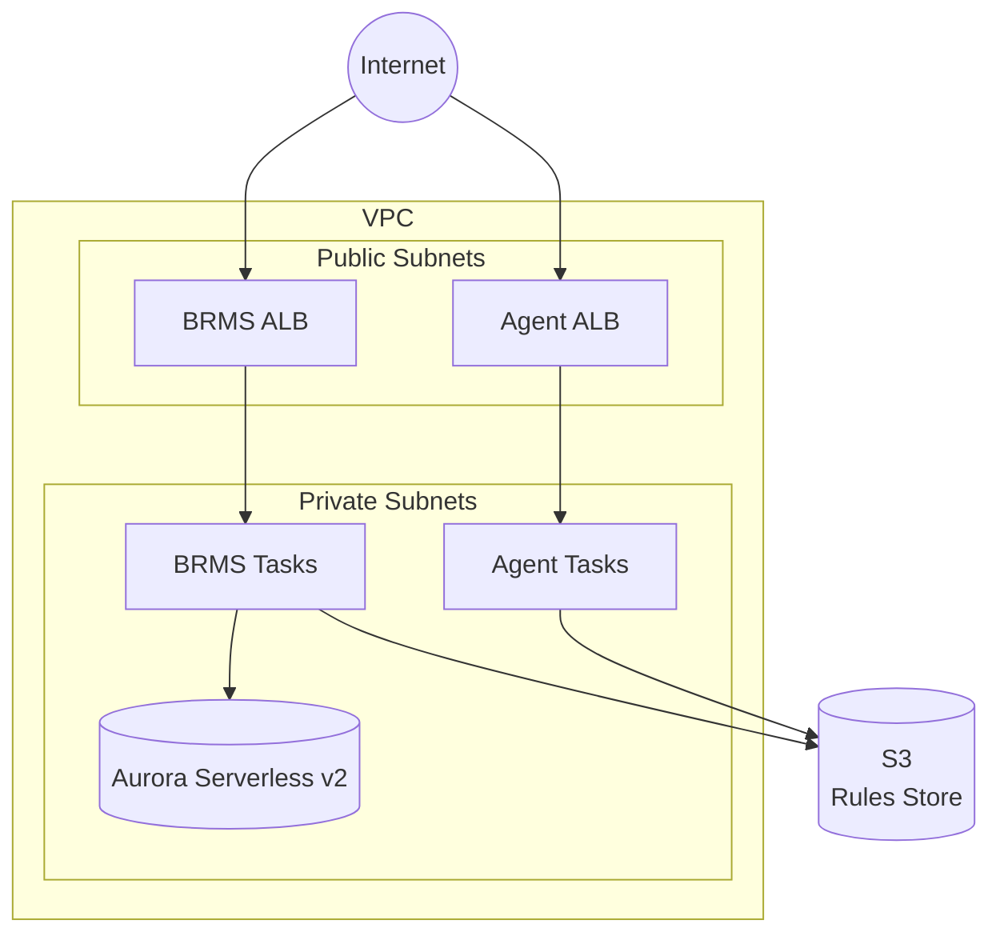

# GoRules Terraform Modules - AWS

Terraform modules for deploying GoRules on AWS ECS Fargate.

> [!WARNING]
> **BRMS Requires HTTPS**
>
> The BRMS frontend uses browser APIs (Web Crypto API, Service Workers) that only work in secure contexts. **Without HTTPS, BRMS will display a blank page.** You must configure a custom domain with an SSL certificate before deploying BRMS. See the [full-stack example](examples/full-stack/) for detailed setup instructions.

## Architecture



## Deployment Patterns

| Pattern    | Components                 | Use Case                        |
| ---------- | -------------------------- | ------------------------------- |
| Full Stack | BRMS + Agent + Aurora + S3 | New deployments, development    |
| Agent Only | Agent + S3                 | Production workloads, stateless |
| BRMS Only  | BRMS + Aurora + S3         | Management UI, rule editing     |

## HTTPS Configuration

### BRMS (HTTPS Required)

BRMS requires HTTPS to function properly. You must provide:
- `domain` - Your custom domain name (required)
- One of the following certificate options:
  - `route53_zone_id` - Automatically creates and validates an ACM certificate
  - `certificate_arn` - Use an existing validated ACM certificate

**Option 1: Automatic certificate with Route53 (recommended)**
```hcl
brms = {
  domain          = "brms.example.com"
  route53_zone_id = "Z1234567890ABC"  # Your Route53 hosted zone ID
  # ... other settings
}
```

**Option 2: Existing ACM certificate**
```hcl
brms = {
  domain          = "brms.example.com"
  certificate_arn = "arn:aws:acm:us-east-1:123456789012:certificate/..."
  # ... other settings
}
```

### Agent (HTTPS Optional)

Agent can run HTTP-only or with HTTPS:

**HTTP-only (no domain)**
```hcl
agent = {
  # No domain specified - runs on ALB DNS with HTTP
  allowed_cidr_blocks = ["10.0.0.0/8"]
  # ... other settings
}
```

**HTTPS with custom domain**
```hcl
agent = {
  domain          = "agent.example.com"
  route53_zone_id = "Z1234567890ABC"  # or certificate_arn
  # ... other settings
}
```

## Internal Load Balancers

By default both ALBs use the internet-facing scheme and require public subnets.
Set `alb_internal = true` on a component to place its ALB in the private subnets
with the internal scheme instead. The ALB nodes then have private IPs only and
are reachable from inside the VPC or from networks connected by VPN, Direct
Connect, Transit Gateway or peering.

Use this when company policy forbids public-subnet resources, or when a service
only needs to be reached from inside your network.

```hcl
brms = {
  domain              = "brms.internal.example.com"
  certificate_arn     = "arn:aws:acm:us-east-1:123456789012:certificate/..."
  allowed_cidr_blocks = ["10.0.0.0/8"]
  alb_internal        = true
  # ... other settings
}
```

When every ALB is internal, public subnets are optional. How you remove them
depends on whether the workload needs outbound internet.

**BRMS needs outbound internet.** It validates its license at
`https://portal.gorules.io`, so it must reach the internet. A VPC with no egress
cannot run BRMS. The Agent is self-contained and needs no egress.

- **Bring your own private VPC** (`vpc.create = false`): pass your existing
  private subnets and an empty `public_subnet_ids`. Your network provides the
  egress through a path that is not a public subnet this module creates, for
  example a Transit Gateway to a shared egress VPC, a proxy, or on-prem breakout.
  The module creates nothing public, and BRMS still reaches the license server.
  This is the path for a BRMS deployment under a no-public-subnet policy.

  ```hcl
  vpc = {
    create             = false
    id                 = "vpc-0123456789abcdef0"
    private_subnet_ids = ["subnet-aaa", "subnet-bbb"]
    public_subnet_ids  = [] # not needed, both ALBs are internal
  }

  brms  = { alb_internal = true, /* ... */ }
  agent = { alb_internal = true, /* ... */ }
  ```

- **Let the module build a fully private VPC** (`vpc.create = true`,
  `nat_gateway_mode = "none"`): the module creates private subnets only, with no
  public-subnet resources, and provisions the VPC endpoints the tasks need (see
  [Egress in a no-public-subnet VPC](#egress-in-a-no-public-subnet-vpc)). This VPC
  has no internet egress, so it suits an agent-only deployment. BRMS cannot run
  here, because it cannot reach the license server.

  ```hcl
  vpc   = { create = true, nat_gateway_mode = "none" }
  agent = { alb_internal = true, /* ... */ } # no brms block
  ```

If you want the module to build the VPC and run BRMS, keep
`nat_gateway_mode = "single"` or `"ha"`. The module then creates public subnets
to host the NAT that gives BRMS its egress. The ALBs stay internal. This does not
satisfy a no-public-subnet policy, so under that policy use the existing-VPC path
above.

### Certificates for internal ALBs

The ALB scheme does not change the certificate requirement. An internal ALB
still terminates TLS. BRMS still requires HTTPS. What changes is the domain:

- Provide `certificate_arn` for an internal deployment. Use AWS Private CA or an
  imported certificate when the domain lives in a private-only zone.
- `route53_zone_id` auto-issue needs a publicly resolvable zone. ACM validates
  the DNS record over public DNS, so a private-only zone cannot be validated.

### HTTP-only ALB behind an edge

If a trusted edge such as CloudFront terminates HTTPS in front of the ALB, you can run the ALB itself over HTTP only and skip the ALB certificate. Set `alb_http_only = true`.

```hcl
brms = {
  domain              = "brms.example.com" # public hostname served by the edge
  allowed_cidr_blocks = ["10.0.0.0/8"]
  alb_internal        = true
  alb_http_only       = true
  # no certificate_arn or route53_zone_id needed
}
```

This is the shape GoRules runs in production: CloudFront with a VPC origin terminates TLS at the edge and connects to the internal ALB over HTTP. The certificate lives on CloudFront (in us-east-1 for a public domain, validated normally), so the internal ALB needs no certificate.

- `alb_http_only` requires `alb_internal = true`. An HTTP-only ALB must be internal and sit behind the edge, never exposed to the internet directly.
- BRMS still requires the browser to use HTTPS, so the edge must provide it. `domain` is still required because BRMS uses it for `APP_URL`.
- Set the CloudFront origin protocol to HTTP (for example `origin_protocol_policy = "http-only"` on a VPC origin).

### Reaching an internal service

1. Point an internal DNS record at the ALB. Use a private hosted zone or your
   corporate DNS, targeting the `brms_alb_dns_name` or `agent_alb_dns_name`
   output.
2. Set `allowed_cidr_blocks` to your internal ranges rather than `0.0.0.0/0`.
3. For public access, keep the ALB internal and front it with an AWS managed
   edge such as CloudFront with a VPC origin.

### Egress in a no-public-subnet VPC

A VPC with no NAT gateway has no route to the internet, so the ECS tasks reach
AWS services through VPC endpoints. The required set is an S3 **gateway** endpoint
(ECR stores image layers in S3) plus **interface** endpoints for `ecr.api`,
`ecr.dkr`, `logs`, `secretsmanager` and `sts`.

These endpoints reach AWS services only. They are not a path to the public
internet. BRMS validates its license at `https://portal.gorules.io`, so it cannot
run in this no-egress VPC. This section applies to an agent-only deployment, or to BRMS when
you provide internet egress another way.

When the module creates the VPC, these are provisioned automatically whenever
`nat_gateway_mode = "none"` (you do not need to set `enable_vpc_endpoints`). The
module also adds, based on your configuration:

- `kms` when `brms.secrets_provider.type = "aws-kms"`.
- `bedrock-runtime` when `brms.ai.provider = "amazon-bedrock"`.

Add any others with `vpc.additional_vpc_endpoints`, for example `ssmmessages`
for ECS Exec, or the `ecs`/`ecs-agent`/`ecs-telemetry` endpoints that Fargate
requires only in AWS Regions launched on or after 2023-12-23. With an existing
VPC (`vpc.create = false`) your network team provides all of these.

> **Container images must be in ECR.** VPC endpoints reach only the Amazon
> network, never Docker Hub or other public registries. The GoRules default
> images (`gorules/brms:latest`, `gorules/agent:latest`) live on Docker Hub and
> **cannot be pulled in a no-NAT VPC**. The tasks fail with
> `CannotPullContainerError`. Mirror the images to a private ECR repository (for
> example `crane copy` or `docker pull|tag|push` from a host with internet) and
> set `brms.image` / `agent.image` to the ECR URI. ECR pull-through cache does
> not avoid this: the first pull of each image still needs internet egress.

Similarly, AI providers reached over the public internet (`openai`, `anthropic`,
`google`, `azure-openai`) are unreachable from a no-NAT VPC; use `amazon-bedrock`
(served via the `bedrock-runtime` endpoint) or keep a NAT gateway. Without egress
the tasks cannot pull images or read secrets, so they fail to start.

See the [Internal ALB example](examples/internal-alb/).

## IAM Database Authentication

When using `database.auth = "iam"`, a Lambda function creates PostgreSQL users
for IAM authentication. This Lambda runs in your VPC and needs to access
AWS Secrets Manager to retrieve master database credentials.

**Network requirement (one of):**
1. **NAT Gateway** - Default when using this module's VPC
2. **Secrets Manager VPC Endpoint** - Set `vpc.enable_vpc_endpoints = true`

Note: This requirement only applies to IAM auth. The default `secrets` auth
mode uses ECS secrets injection, which doesn't require VPC connectivity.

## Security Features

- **SSL Enforcement**: Database connections require SSL via cluster parameter group (`rds.force_ssl = 1`)
- **ALB Deletion Protection**: Enabled by default for both BRMS and Agent ALBs (configurable via `alb_deletion_protection`)
- **CloudWatch Alarms**: CPU, memory, 5xx errors, and unhealthy targets monitoring with optional SNS notifications
- **Secrets Encryption**: BRMS secrets are encrypted using configurable providers (see below)

## BRMS Secrets Provider

BRMS requires a secrets provider for encrypting sensitive data stored in rules. The module supports two providers:

> [!CAUTION]
> **Do Not Delete Encryption Keys**
>
> The master key (env provider) or KMS key (aws-kms provider) is used to encrypt all BRMS secrets. If deleted or changed, **all encrypted secrets become permanently unrecoverable**. Ensure proper backup and access controls for these critical resources.

### Environment Variable Provider (Default)

Uses a master key stored in Secrets Manager. Simple setup, suitable for most deployments.

```hcl
brms = {
  # ... other settings
  secrets_provider = {
    type              = "env"        # Default
    master_key_length = 64           # Min 32 characters
  }
}
```

### AWS KMS Provider

Uses AWS KMS for encryption. Recommended for enterprise deployments requiring centralized key management.

**Create new KMS key:**
```hcl
brms = {
  # ... other settings
  secrets_provider = {
    type          = "aws-kms"
    kms_key_alias = "gorules-brms-secrets"  # Optional alias
  }
}
```

**Use existing KMS key:**
```hcl
brms = {
  # ... other settings
  secrets_provider = {
    type           = "aws-kms"
    create_kms_key = false
    kms_key_arn    = "arn:aws:kms:us-east-1:123456789012:key/..."
  }
}
```

## AI/LLM Configuration

BRMS has an optional AI assistant that helps users build and edit rules. To enable it, configure the `brms.ai` block with your LLM provider.

Supported providers: `openai`, `anthropic`, `google`, `amazon-bedrock`, `azure-openai`

See the [GoRules AI setup guide](https://docs.gorules.io/developers/deployment/brms/ai-setup) for details on how the AI assistant works within BRMS.

**Anthropic (Claude)**
```hcl
brms = {
  # ... other settings
  ai = {
    provider           = "anthropic"
    model              = "claude-sonnet-4-6"
    api_key_secret_arn = "arn:aws:secretsmanager:us-east-1:123456789012:secret:anthropic-api-key-AbCdEf"
  }
}
```

**Amazon Bedrock**

Bedrock uses IAM for authentication, so no API key is needed. The module automatically creates the required `bedrock:InvokeModel` IAM policy scoped to the specified model. Use inference profile IDs with a geographic prefix (e.g., `us.`, `eu.`, `apac.`).

```hcl
brms = {
  # ... other settings
  ai = {
    provider = "amazon-bedrock"
    model    = "us.anthropic.claude-sonnet-4-6-20250514-v1:0"
  }
}
```

**Azure OpenAI**

Requires the `azure_resource_name` of your Azure OpenAI deployment.

```hcl
brms = {
  # ... other settings
  ai = {
    provider            = "azure-openai"
    model               = "gpt-4o"
    api_key_secret_arn  = "arn:aws:secretsmanager:us-east-1:123456789012:secret:azure-openai-key-AbCdEf"
    azure_resource_name = "my-openai-resource"
  }
}
```

| Parameter | Default | Description |
|-----------|---------|-------------|
| `provider` | n/a | LLM provider (required) |
| `model` | n/a | Model name or inference profile ID (required). For amazon-bedrock, use inference profile IDs with a geographic prefix. |
| `api_key_secret_arn` | `null` | Secrets Manager ARN for the API key (required for all providers except amazon-bedrock) |
| `temperature` | `0.4` | Sampling temperature (0 to 2) |
| `max_output_tokens` | `32000` | Maximum output tokens |
| `thinking_level` | `"medium"` | Thinking level: `high`, `medium` |
| `context_window` | `null` | Override context window size |
| `azure_resource_name` | `null` | Azure OpenAI resource name (required for azure-openai) |

## Examples

- [Full Stack](examples/full-stack/)
- [Agent Only](examples/agent-only/)
- [Existing VPC](examples/existing-vpc/)
- [Internal ALB](examples/internal-alb/)
- [Multi-Environment](examples/multi-environment/)

## Requirements

| Name      | Version |
| --------- | ------- |
| terraform | >= 1.14 |
| aws       | >= 6.0  |
| random    | >= 3.8  |
| http      | >= 3.5  |
| archive   | >= 2.7  |
| null      | >= 3.2  |

## State Management

Configure remote state with S3 and DynamoDB:

```hcl
terraform {
  backend "s3" {
    bucket         = "my-terraform-state"
    key            = "gorules/terraform.tfstate"
    region         = "us-east-1"
    dynamodb_table = "terraform-locks"
    encrypt        = true
  }
}
```

