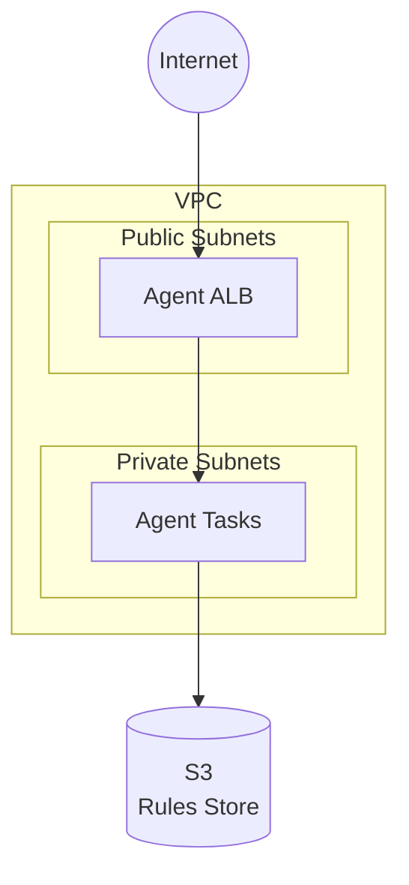

# GoRules Agent-Only Example

This example deploys only the GoRules Agent on AWS ECS Fargate:

- **VPC**: New VPC with public and private subnets, NAT Gateway
- **Storage**: S3 bucket for rules storage (or use existing bucket)
- **Agent**: Stateless rule evaluation API

## Architecture



## Prerequisites

1. AWS CLI configured with appropriate credentials
2. Terraform >= 1.14
3. Rules published to S3 (either from BRMS or manually)

## HTTPS Configuration (Optional)

The Agent can run HTTP-only or with HTTPS. For production environments exposed to the internet, HTTPS is recommended.

**HTTP-only (default):**
No additional configuration needed. The Agent will be accessible via the ALB DNS name over HTTP.

**HTTPS with custom domain:**

1. Create an ACM certificate for your domain (see [full-stack example](../full-stack/README.md#step-2-configure-https-certificate) for detailed instructions)
2. Add to your tfvars:

```hcl
agent_domain          = "agent.example.com"
agent_certificate_arn = "arn:aws:acm:us-east-1:123456789012:certificate/..."
# Or use Route53 for automatic certificate:
# agent_route53_zone_id = "Z1234567890ABC"
```

3. After deployment, create a DNS record pointing to the ALB (if not using Route53)

## Usage

1. Copy the example tfvars file:

```bash
cp terraform.tfvars.example terraform.tfvars
```

2. Edit `terraform.tfvars` with your values:

```hcl
project_name = "gorules"
environment  = "prod"
region       = "us-east-1"
```

3. Initialize Terraform:

```bash
terraform init
```

4. Review the plan:

```bash
terraform plan
```

5. Apply the configuration:

```bash
terraform apply
```

## Using an Existing S3 Bucket

If you already have rules stored in an S3 bucket (e.g., from a separate BRMS deployment):

```hcl
create_bucket        = false
existing_bucket_arn  = "arn:aws:s3:::my-gorules-rules-bucket"
existing_bucket_name = "my-gorules-rules-bucket"
```

The module will create the necessary IAM policies to allow the Agent to read from the existing bucket.

## Outputs

After deployment, Terraform will output:

| Output               | Description                      |
| -------------------- | -------------------------------- |
| `agent_url`          | URL for the Agent API            |
| `agent_alb_dns_name` | ALB DNS name (for Route53 alias) |
| `agent_alb_zone_id`  | ALB zone ID (for Route53 alias)  |
| `vpc_id`             | VPC ID                           |
| `private_subnet_ids` | Private subnet IDs               |
| `public_subnet_ids`  | Public subnet IDs                |
| `s3_bucket_name`     | S3 bucket name                   |
| `s3_bucket_arn`      | S3 bucket ARN                    |
| `ecs_cluster_name`   | ECS cluster name                 |
| `ecs_cluster_arn`    | ECS cluster ARN                  |

## Scaling for High Throughput

The Agent is stateless and can scale horizontally. For high-throughput workloads:

```hcl
# Increase task size for complex rules
agent_cpu    = 512
agent_memory = 1024

# Scale aggressively
agent_min_count = 5
agent_max_count = 50

# Reduce polling interval for faster rule updates
agent_env = [
  { name = "POLL_INTERVAL", value = "1000" }
]
```

## Cost Optimization

For development or low-traffic environments:

```hcl
# Use single NAT Gateway
nat_gateway_mode = "single"

# Minimal task size
agent_cpu    = 256
agent_memory = 512

# Scale down when idle
agent_min_count = 1
agent_max_count = 5

# Enable VPC endpoints to reduce NAT traffic
enable_vpc_endpoints = true
```

## Cleanup

To destroy all resources:

```bash
terraform destroy
```
