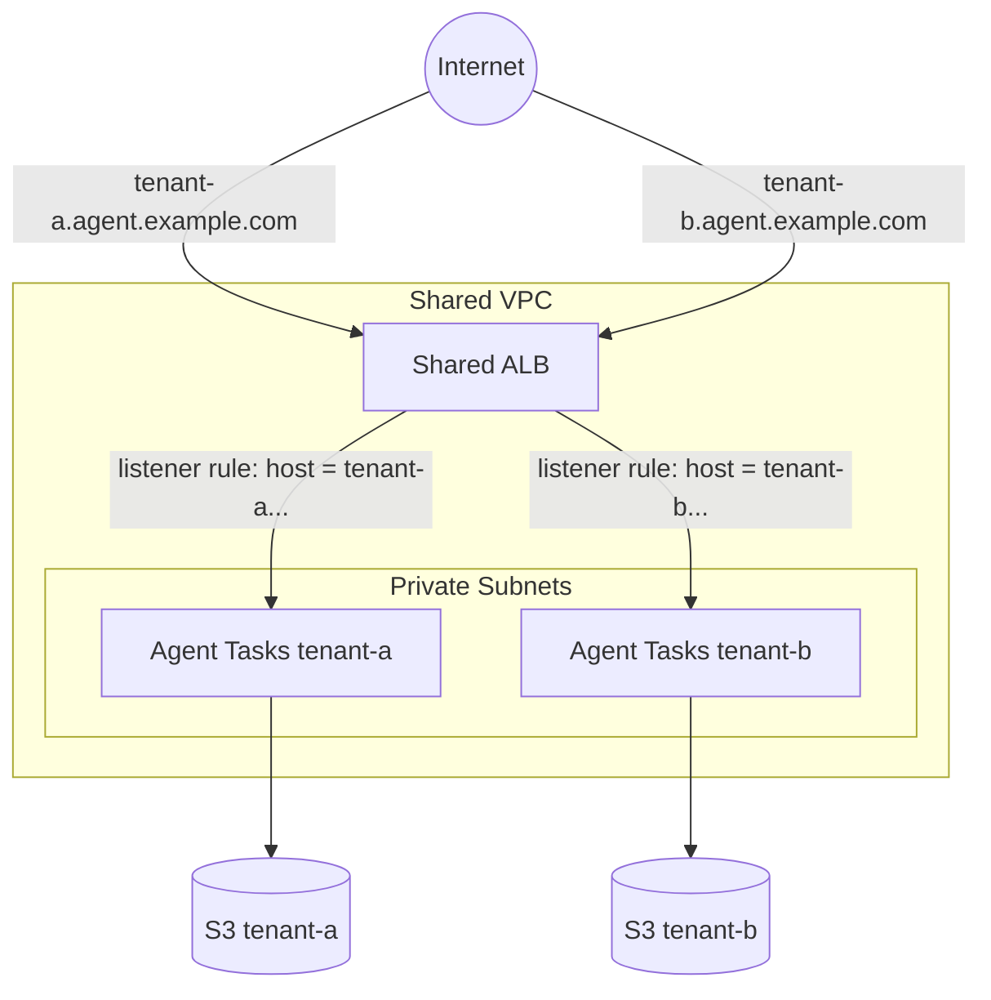

# GoRules Existing ALB Example

This example deploys an additional Agent behind an **existing ALB**, instead of creating a new one:

- **VPC**: Uses your existing VPC (the one the ALB lives in)
- **ALB**: Attaches to an existing listener via a host-based listener rule
- **Storage**: S3 bucket for rules storage (or an existing bucket)
- **Agent**: Stateless rule evaluation API

Use this pattern to run multiple Agent deployments (per tenant, team, or business unit) that share one VPC, one NAT gateway, and one ALB. Each deployment gets its own ECS service, task definition, autoscaling, IAM role, and domain. The shared ALB routes requests to the right service by hostname.

## Architecture



## How it works

One invocation **owns** the ALB (any regular deployment, e.g. the [agent-only](../agent-only/) or [internal-alb](../internal-alb/) example). It exposes two outputs:

- `agent_https_listener_arn` (or `agent_http_listener_arn` for HTTP-only internal ALBs)
- `agent_alb_security_group_id`

Every additional invocation (this example) sets `agent.alb.create = false` and passes those two values. The module then:

- skips the ALB, listeners, and ALB security group
- creates a listener rule on the shared listener matching the deployment's `domain` (host-based routing)
- creates and validates an ACM certificate for the domain and attaches it to the shared listener via SNI
- creates the Route53 alias record pointing at the shared ALB
- wires security groups: tasks accept traffic from the ALB's security group, and the ALB's security group gets an egress rule to the tasks

Each deployment keeps its own domain and certificate, so no wildcard certificate or coordination between deployments is needed. An ALB supports up to 25 additional certificates (SNI) and 100 listener rules by default.

## Prerequisites Checklist

- [ ] AWS CLI configured with appropriate credentials
- [ ] Terraform >= 1.14
- [ ] An existing GoRules deployment (or your own ALB) exposing a listener ARN and its security group ID
- [ ] A domain for this deployment (e.g., `tenant-a.agent.example.com`)
- [ ] Route53 hosted zone OR existing ACM certificate for that domain

> [!NOTE]
> Client access to the shared ALB is controlled by the **owner's** `allowed_cidr_blocks`. This deployment's traffic must be allowed there. `alb_internal`, `alb_http_only`, `alb_deletion_protection`, `alb_idle_timeout` and `allowed_cidr_blocks` are owner-side settings and are ignored when `agent.alb.create = false`.

> [!NOTE]
> If the shared listener is HTTP-only (internal ALB behind CloudFront or another TLS-terminating edge), set `alb_http_only = true` on the agent so no certificate is created or attached, and pass `agent_route53_zone_id = null`.

## Step 1: Get the ALB details from the owning deployment

```bash
terraform -chdir=../agent-only output agent_https_listener_arn
terraform -chdir=../agent-only output agent_alb_security_group_id
```

Or from your own ALB: the listener ARN (`aws elbv2 describe-listeners`) and its security group ID.

## Step 2: Deploy

```bash
cp terraform.tfvars.example terraform.tfvars
# Edit terraform.tfvars with your values
terraform init
terraform plan
terraform apply
```

## Step 3: Verify

```bash
curl https://tenant-a.agent.example.com/api/health
```

## Rule evaluation

Point each deployment at its own rules location with `PROVIDER__PREFIX` (or a separate bucket per deployment):

```hcl
agent_env = [
  { name = "PROVIDER__PREFIX", value = "rules/tenant-a/" }
]
```

## Routing conditions

The listener rule matches on `agent.domain` by default. `agent.alb.host_headers` **replaces** `domain` as the routing condition when set (`domain` still drives the certificate and DNS record, so keep it listed in `host_headers` too). If you set `agent.alb.path_patterns` without any host condition, the rule matches that path for **every** hostname on the shared listener, so on a multi-tenant ALB always pair paths with a host condition.

## Listener rule priorities

Rule priorities are auto-assigned (next available) when `alb_rule_priority` is null. Pin explicit priorities only if you need deterministic evaluation order. Host-based rules for distinct hostnames never overlap, so auto-assignment is safe for this pattern. Avoid applying multiple attaching deployments concurrently with auto-assigned priorities: both compute the same "next available" value and one fails with `PriorityInUse` (re-apply, or pin priorities).

## Cleanup

```bash
terraform destroy
```

This removes the listener rule, certificate, DNS record, and ECS resources of this deployment only. The shared ALB and VPC stay untouched. Destroy attaching deployments **before** the owner: the owner's ALB security group is referenced by each attacher's rules, so destroying the owner first fails with `DependencyViolation`.
