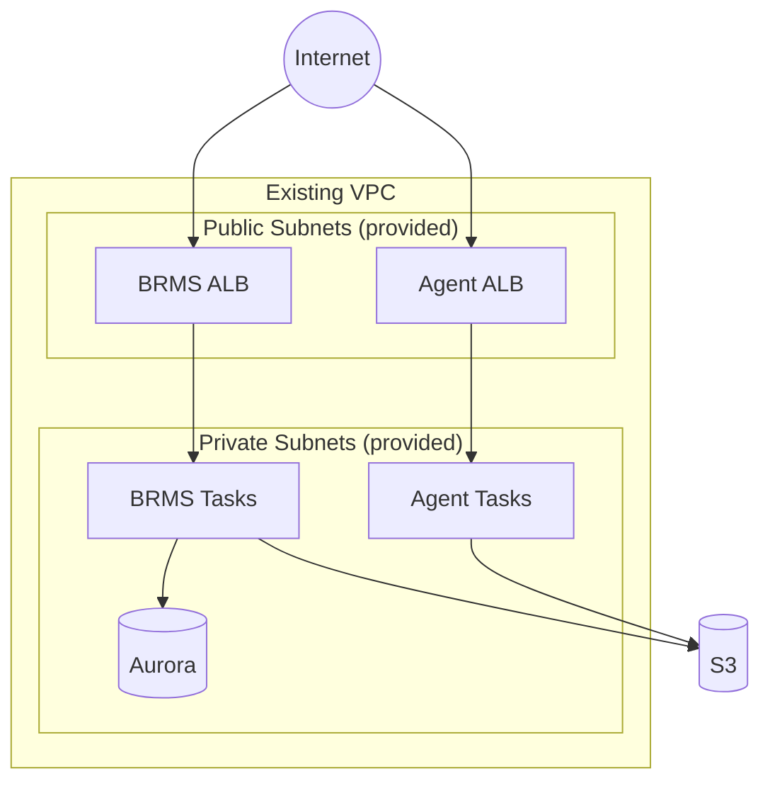

# GoRules Existing VPC Example

This example deploys the complete GoRules stack into an existing VPC:

- **VPC**: Uses your existing VPC, public subnets, and private subnets
- **Database**: Aurora Serverless v2 PostgreSQL
- **Storage**: S3 bucket for rules storage
- **BRMS**: Business Rules Management System (UI + API)
- **Agent**: Stateless rule evaluation API

Use this pattern when you have an existing VPC with established networking, security groups, or VPC peering connections.

> [!WARNING]
> **BRMS Requires HTTPS**
>
> Without HTTPS, BRMS will display a blank page. The BRMS frontend uses browser APIs (Web Crypto API, Service Workers) that only work in secure contexts. You **must** configure HTTPS before deploying.
>
> Complete the certificate setup in the prerequisites below before running `terraform apply`.

## Architecture



## Prerequisites Checklist

Before deploying, ensure you have:

- [ ] AWS CLI configured with appropriate credentials
- [ ] Terraform >= 1.14
- [ ] GoRules license key
- [ ] Custom domain for BRMS (e.g., `brms.example.com`)
- [ ] Route53 hosted zone OR existing ACM certificate for your domain
- [ ] Existing VPC meeting the requirements below

### VPC Requirements

Your existing VPC must have:

| Requirement | Description |
|-------------|-------------|
| Public Subnets | At least 2, in different AZs, with route to Internet Gateway |
| Private Subnets | At least 2, in different AZs, with route to NAT Gateway |
| DNS Hostnames | `enable_dns_hostnames = true` |
| DNS Support | `enable_dns_support = true` |

## Step 1: Create GoRules License Secret

Store your GoRules license key in AWS Secrets Manager:

```bash
aws secretsmanager create-secret \
  --name gorules-license-key \
  --secret-string "YOUR_GORULES_LICENSE_KEY" \
  --region us-east-1
```

Note the ARN from the output - you'll need it for `brms_license_key_secret_arn`.

## Step 2: Configure HTTPS Certificate

Choose **one** of the following options. See the [full-stack example](../full-stack/README.md#step-2-configure-https-certificate) for detailed instructions.

### Option A: Automatic Certificate with Route53 (Recommended)

Find your Route53 hosted zone ID:

```bash
aws route53 list-hosted-zones \
  --query 'HostedZones[*].[Id,Name]' \
  --output table
```

### Option B: Existing ACM Certificate

List your certificates:

```bash
aws acm list-certificates \
  --query 'CertificateSummaryList[*].[CertificateArn,DomainName]' \
  --output table \
  --region us-east-1
```

## Step 3: Find Your VPC Details

Use AWS CLI to find your VPC and subnet IDs:

```bash
# List VPCs
aws ec2 describe-vpcs --query 'Vpcs[*].[VpcId,Tags[?Key==`Name`].Value|[0]]' --output table

# List subnets for a VPC
aws ec2 describe-subnets \
  --filters "Name=vpc-id,Values=vpc-0123456789abcdef0" \
  --query 'Subnets[*].[SubnetId,AvailabilityZone,Tags[?Key==`Name`].Value|[0],MapPublicIpOnLaunch]' \
  --output table
```

Subnets with `MapPublicIpOnLaunch=True` are typically public subnets.

## Step 4: Configure Terraform Variables

1. Copy the example tfvars file:

```bash
cp terraform.tfvars.example terraform.tfvars
```

2. Edit `terraform.tfvars` with your values:

**Using Route53 (Option A):**

```hcl
project_name = "gorules"
environment  = "prod"
region       = "us-east-1"

# Your existing VPC
vpc_id             = "vpc-0123456789abcdef0"
private_subnet_ids = ["subnet-private-1a", "subnet-private-1b"]
public_subnet_ids  = ["subnet-public-1a", "subnet-public-1b"]

# License key
brms_license_key_secret_arn = "arn:aws:secretsmanager:us-east-1:123456789012:secret:gorules-license-key-AbCdEf"

# HTTPS configuration (Route53 automatic)
brms_domain          = "brms.example.com"
brms_route53_zone_id = "Z1234567890ABC"
```

**Using existing certificate (Option B):**

```hcl
project_name = "gorules"
environment  = "prod"
region       = "us-east-1"

# Your existing VPC
vpc_id             = "vpc-0123456789abcdef0"
private_subnet_ids = ["subnet-private-1a", "subnet-private-1b"]
public_subnet_ids  = ["subnet-public-1a", "subnet-public-1b"]

# License key
brms_license_key_secret_arn = "arn:aws:secretsmanager:us-east-1:123456789012:secret:gorules-license-key-AbCdEf"

# HTTPS configuration (existing certificate)
brms_domain          = "brms.example.com"
brms_certificate_arn = "arn:aws:acm:us-east-1:123456789012:certificate/..."
```

### Secrets Provider Configuration (Optional)

BRMS encrypts sensitive data (like API keys stored in rules). By default, it uses an auto-generated master key (`env` provider). For enhanced security, you can use AWS KMS instead.

**Default (env provider):** No configuration needed. A 64-character master key is auto-generated and stored in Secrets Manager.

**Using AWS KMS (recommended for production):**

```hcl
# Create a new KMS key
brms_secrets_provider_type = "aws-kms"

# Or use an existing KMS key
brms_secrets_provider_type           = "aws-kms"
brms_secrets_provider_create_kms_key = false
brms_secrets_provider_kms_key_arn    = "arn:aws:kms:us-east-1:123456789012:key/12345678-1234-1234-1234-123456789012"
```

| Variable | Default | Description |
|----------|---------|-------------|
| `brms_secrets_provider_type` | `"env"` | `"env"` (master key) or `"aws-kms"` |
| `brms_secrets_provider_master_key_length` | `64` | Master key length for env provider (min 32) |
| `brms_secrets_provider_create_kms_key` | `true` | Create new KMS key for aws-kms provider |
| `brms_secrets_provider_kms_key_arn` | `null` | Existing KMS key ARN (required if create_kms_key=false) |
| `brms_secrets_provider_kms_key_alias` | `null` | Alias for created KMS key |
| `brms_secrets_provider_kms_deletion_window` | `30` | KMS key deletion window in days (7-30) |

### AI/LLM Configuration (Optional)

BRMS includes an AI assistant for building rules. To enable it, add the AI variables to your tfvars:

```hcl
brms_ai_enabled            = true
brms_ai_provider           = "anthropic"
brms_ai_model              = "claude-sonnet-4-6"
brms_ai_api_key_secret_arn = "arn:aws:secretsmanager:us-east-1:123456789012:secret:anthropic-api-key-AbCdEf"
```

Amazon Bedrock doesn't require an API key — it uses IAM authentication instead.

See the [full-stack example](../full-stack/README.md#aillm-configuration-optional) for detailed setup instructions and all available variables.

## Step 5: Deploy

```bash
terraform init
terraform plan
terraform apply
```

## Step 6: Configure DNS (If Using Existing Certificate)

If you used Option B, create DNS records pointing to the ALBs. See the [full-stack example](../full-stack/README.md#step-5-configure-dns-if-using-existing-certificate) for detailed instructions.

## Security Considerations

When using an existing VPC:

1. **Security Groups**: The module creates new security groups for ALBs, ECS tasks, and Aurora. Review these after deployment.

2. **Network ACLs**: Ensure your existing NACLs allow:
   - Inbound HTTP/HTTPS to public subnets
   - Outbound to NAT Gateway from private subnets
   - Internal traffic between subnets

3. **VPC Flow Logs**: Consider enabling VPC Flow Logs if not already enabled.

## Outputs

After deployment, Terraform will output:

| Output | Description |
|--------|-------------|
| `brms_url` | URL to access the BRMS UI |
| `brms_alb_dns_name` | ALB DNS name (for Route53 alias) |
| `brms_alb_zone_id` | ALB zone ID (for Route53 alias) |
| `agent_url` | URL for the Agent API |
| `agent_alb_dns_name` | Agent ALB DNS name |
| `agent_alb_zone_id` | Agent ALB zone ID |
| `vpc_id` | VPC ID (existing) |
| `private_subnet_ids` | Private subnet IDs (existing) |
| `public_subnet_ids` | Public subnet IDs (existing) |
| `s3_bucket_name` | S3 bucket name |
| `s3_bucket_arn` | S3 bucket ARN |
| `database_endpoint` | Aurora cluster endpoint |
| `database_reader_endpoint` | Aurora reader endpoint |
| `database_port` | Database port |
| `database_name` | Database name |
| `ecs_cluster_name` | ECS cluster name |
| `ecs_cluster_arn` | ECS cluster ARN |
| `database_credentials_secret_arn` | Database credentials secret ARN |
| `cookie_secret_arn` | BRMS cookie secret ARN |
| `secrets_master_key_secret_arn` | BRMS secrets master key ARN (null if using aws-kms) |
| `brms_kms_key_arn` | KMS key ARN for BRMS secrets (null if using env provider) |

## Troubleshooting

### BRMS shows a blank page

This almost always means HTTPS is not configured correctly:

1. Verify you're accessing via `https://` not `http://`
2. Check the certificate is valid: `aws acm describe-certificate --certificate-arn YOUR_ARN`
3. Verify DNS resolves to the ALB: `nslookup brms.example.com`

### ECS tasks can't reach the internet

Verify your private subnets have a route to a NAT Gateway:

```bash
aws ec2 describe-route-tables \
  --filters "Name=association.subnet-id,Values=subnet-private-1a" \
  --query 'RouteTables[*].Routes[*].[DestinationCidrBlock,NatGatewayId,GatewayId]' \
  --output table
```

### Database connection errors

Verify the Aurora security group allows traffic from the ECS task security group.

## Cleanup

To destroy all resources:

```bash
terraform destroy
```

Note: This only destroys GoRules resources. Your existing VPC and subnets are not affected.
