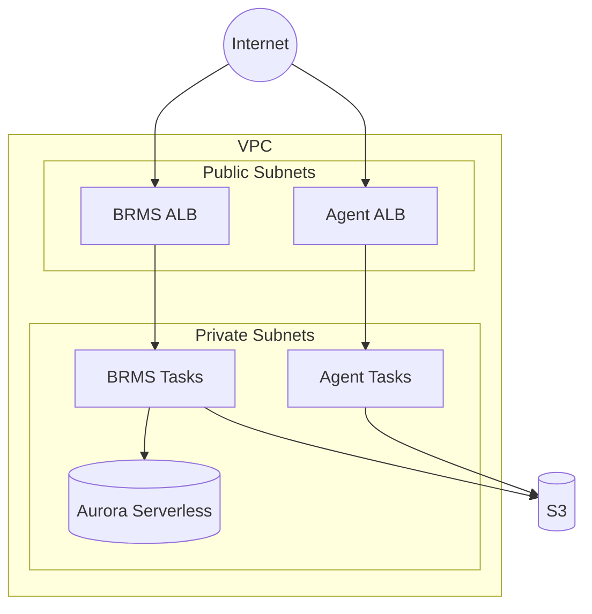

# GoRules Full Stack Example

This example deploys the complete GoRules stack on AWS ECS Fargate:

- **VPC**: New VPC with public and private subnets, NAT Gateway
- **Database**: Aurora Serverless v2 PostgreSQL
- **Storage**: S3 bucket for rules storage
- **BRMS**: Business Rules Management System (UI + API)
- **Agent**: Stateless rule evaluation API

> [!WARNING]
> **BRMS Requires HTTPS**
>
> Without HTTPS, BRMS will display a blank page. The BRMS frontend uses browser APIs (Web Crypto API, Service Workers) that only work in secure contexts. You **must** configure HTTPS before deploying.
>
> Complete the certificate setup in the prerequisites below before running `terraform apply`.

## Architecture



## Prerequisites Checklist

Before deploying, ensure you have:

- [ ] AWS CLI configured with appropriate credentials
- [ ] Terraform >= 1.14
- [ ] GoRules license key
- [ ] Custom domain for BRMS (e.g., `brms.example.com`)
- [ ] Route53 hosted zone OR existing ACM certificate for your domain

## Step 1: Create GoRules License Secret

Store your GoRules license key in AWS Secrets Manager:

```bash
aws secretsmanager create-secret \
  --name gorules-license-key \
  --secret-string "YOUR_GORULES_LICENSE_KEY" \
  --region us-east-1
```

Note the ARN from the output - you'll need it for `brms.license_key_secret_arn`.

To retrieve the ARN later:

```bash
aws secretsmanager describe-secret \
  --secret-id gorules-license-key \
  --query 'ARN' \
  --output text \
  --region us-east-1
```

## Step 2: Configure HTTPS Certificate

Choose **one** of the following options:

### Option A: Automatic Certificate with Route53 (Recommended)

If your domain is managed by Route53, the module can automatically create and validate an ACM certificate.

Find your Route53 hosted zone ID:

```bash
aws route53 list-hosted-zones \
  --query 'HostedZones[*].[Id,Name]' \
  --output table
```

The zone ID looks like `Z1234567890ABC` (without the `/hostedzone/` prefix).

### Option B: Existing ACM Certificate

If you already have an ACM certificate or your domain is not in Route53:

1. **Create a certificate** (if you don't have one):

```bash
aws acm request-certificate \
  --domain-name brms.example.com \
  --validation-method DNS \
  --region us-east-1
```

2. **Validate the certificate** by adding the DNS record shown in the ACM console or via CLI:

```bash
# Get validation record details
aws acm describe-certificate \
  --certificate-arn "arn:aws:acm:us-east-1:123456789012:certificate/..." \
  --query 'Certificate.DomainValidationOptions[0].ResourceRecord' \
  --region us-east-1
```

3. **Wait for validation** (can take up to 30 minutes):

```bash
aws acm wait certificate-validated \
  --certificate-arn "arn:aws:acm:us-east-1:123456789012:certificate/..." \
  --region us-east-1
```

4. **List your certificates** to find the ARN:

```bash
aws acm list-certificates \
  --query 'CertificateSummaryList[*].[CertificateArn,DomainName]' \
  --output table \
  --region us-east-1
```

## Step 3: Configure Terraform Variables

1. Copy the example tfvars file:

```bash
cp terraform.tfvars.example terraform.tfvars
```

2. Edit `terraform.tfvars` with your values:

**Using Route53 (Option A):**

```hcl
project_name = "gorules"
environment  = "prod"
region       = "us-east-1"

brms_license_key_secret_arn = "arn:aws:secretsmanager:us-east-1:123456789012:secret:gorules-license-key-AbCdEf"

# HTTPS configuration (Route53 automatic)
brms_domain          = "brms.example.com"
brms_route53_zone_id = "Z1234567890ABC"

# Optional: HTTPS for Agent
agent_domain          = "agent.example.com"
agent_route53_zone_id = "Z1234567890ABC"
```

**Using existing certificate (Option B):**

```hcl
project_name = "gorules"
environment  = "prod"
region       = "us-east-1"

brms_license_key_secret_arn = "arn:aws:secretsmanager:us-east-1:123456789012:secret:gorules-license-key-AbCdEf"

# HTTPS configuration (existing certificate)
brms_domain          = "brms.example.com"
brms_certificate_arn = "arn:aws:acm:us-east-1:123456789012:certificate/..."

# Optional: HTTPS for Agent
agent_domain          = "agent.example.com"
agent_certificate_arn = "arn:aws:acm:us-east-1:123456789012:certificate/..."
```

### Secrets Provider Configuration (Optional)

BRMS encrypts sensitive data (like API keys stored in rules). By default, it uses an auto-generated master key (`env` provider). For enhanced security, you can use AWS KMS instead.

**Default (env provider):** No configuration needed. A 64-character master key is auto-generated and stored in Secrets Manager.

**Using AWS KMS (recommended for production):**

```hcl
# Create a new KMS key
brms_secrets_provider_type = "aws-kms"

# Or use an existing KMS key
brms_secrets_provider_type           = "aws-kms"
brms_secrets_provider_create_kms_key = false
brms_secrets_provider_kms_key_arn    = "arn:aws:kms:us-east-1:123456789012:key/12345678-1234-1234-1234-123456789012"
```

| Variable | Default | Description |
|----------|---------|-------------|
| `brms_secrets_provider_type` | `"env"` | `"env"` (master key) or `"aws-kms"` |
| `brms_secrets_provider_master_key_length` | `64` | Master key length for env provider (min 32) |
| `brms_secrets_provider_create_kms_key` | `true` | Create new KMS key for aws-kms provider |
| `brms_secrets_provider_kms_key_arn` | `null` | Existing KMS key ARN (required if create_kms_key=false) |
| `brms_secrets_provider_kms_key_alias` | `null` | Alias for created KMS key |
| `brms_secrets_provider_kms_deletion_window` | `30` | KMS key deletion window in days (7-30) |

### AI/LLM Configuration (Optional)

BRMS includes an AI assistant for building rules. To enable it, add the AI variables to your tfvars.

**Using Anthropic:**

```hcl
brms_ai_enabled            = true
brms_ai_provider           = "anthropic"
brms_ai_model              = "claude-sonnet-4-6"
brms_ai_api_key_secret_arn = "arn:aws:secretsmanager:us-east-1:123456789012:secret:anthropic-api-key-AbCdEf"
```

**Using Amazon Bedrock (no API key needed):**

```hcl
brms_ai_enabled  = true
brms_ai_provider = "amazon-bedrock"
brms_ai_model    = "us.anthropic.claude-sonnet-4-6-20250514-v1:0"
```

Store your API key in Secrets Manager before deploying (not needed for Bedrock):

```bash
aws secretsmanager create-secret \
  --name gorules-llm-api-key \
  --secret-string "YOUR_API_KEY" \
  --region us-east-1
```

| Variable | Default | Description |
|----------|---------|-------------|
| `brms_ai_enabled` | `false` | Enable AI assistant |
| `brms_ai_provider` | `"anthropic"` | LLM provider: `openai`, `anthropic`, `google`, `amazon-bedrock`, `azure-openai` |
| `brms_ai_model` | `"claude-sonnet-4-6"` | Model name |
| `brms_ai_api_key_secret_arn` | `null` | Secrets Manager ARN for the API key |
| `brms_ai_temperature` | `0.4` | Sampling temperature (0–2) |
| `brms_ai_thinking_level` | `"medium"` | Thinking level: `high`, `medium` |

See the [AI setup guide](https://docs.gorules.io/developers/deployment/brms/ai-setup) and [root module docs](../../README.md#aillm-configuration) for all options.

## Step 4: Deploy

```bash
terraform init
terraform plan
terraform apply
```

## Step 5: Configure DNS (If Using Existing Certificate)

If you used Option B (existing certificate), create DNS records pointing to the ALBs.

After deployment, get the ALB DNS names:

```bash
terraform output brms_alb_dns_name
terraform output brms_alb_zone_id
```

Create a Route53 alias record (or equivalent in your DNS provider):

```bash
# Example for Route53
aws route53 change-resource-record-sets \
  --hosted-zone-id YOUR_ZONE_ID \
  --change-batch '{
    "Changes": [{
      "Action": "CREATE",
      "ResourceRecordSet": {
        "Name": "brms.example.com",
        "Type": "A",
        "AliasTarget": {
          "HostedZoneId": "ALB_ZONE_ID_FROM_OUTPUT",
          "DNSName": "ALB_DNS_NAME_FROM_OUTPUT",
          "EvaluateTargetHealth": true
        }
      }
    }]
  }'
```

If using Route53 with Option A, DNS records are created automatically.

## Step 6: Verify Deployment

1. **Check ECS services are running:**

```bash
aws ecs list-services --cluster gorules-prod-cluster --region us-east-1
aws ecs describe-services \
  --cluster gorules-prod-cluster \
  --services gorules-prod-brms gorules-prod-agent \
  --query 'services[*].[serviceName,runningCount,desiredCount]' \
  --output table \
  --region us-east-1
```

2. **Access BRMS:**

```bash
terraform output brms_url
```

Open the URL in your browser. You should see the GoRules login page.

3. **Test Agent health:**

```bash
curl $(terraform output -raw agent_url)/api/health
```

## Outputs

After deployment, Terraform will output:

| Output | Description |
|--------|-------------|
| `brms_url` | URL to access the BRMS UI |
| `brms_alb_dns_name` | ALB DNS name (for Route53 alias) |
| `brms_alb_zone_id` | ALB zone ID (for Route53 alias) |
| `agent_url` | URL for the Agent API |
| `agent_alb_dns_name` | Agent ALB DNS name |
| `agent_alb_zone_id` | Agent ALB zone ID |
| `vpc_id` | VPC ID |
| `private_subnet_ids` | Private subnet IDs |
| `public_subnet_ids` | Public subnet IDs |
| `s3_bucket_name` | S3 bucket name |
| `s3_bucket_arn` | S3 bucket ARN |
| `database_endpoint` | Aurora cluster endpoint |
| `database_reader_endpoint` | Aurora reader endpoint |
| `database_port` | Database port |
| `database_name` | Database name |
| `ecs_cluster_name` | ECS cluster name |
| `ecs_cluster_arn` | ECS cluster ARN |
| `database_credentials_secret_arn` | Database credentials secret ARN |
| `cookie_secret_arn` | BRMS cookie secret ARN |
| `secrets_master_key_secret_arn` | BRMS secrets master key ARN (null if using aws-kms) |
| `brms_kms_key_arn` | KMS key ARN for BRMS secrets (null if using env provider) |

## Troubleshooting

### BRMS shows a blank page

This almost always means HTTPS is not configured correctly:

1. Verify you're accessing via `https://` not `http://`
2. Check the certificate is valid: `aws acm describe-certificate --certificate-arn YOUR_ARN`
3. Verify DNS resolves to the ALB: `nslookup brms.example.com`

### ECS tasks keep restarting

Check the CloudWatch logs:

```bash
aws logs tail /ecs/gorules-prod/brms --follow --region us-east-1
```

Common issues:
- Invalid license key
- Database connection failures (check security groups)
- Missing environment variables

### Database connection errors

Verify the security group allows traffic from ECS tasks:

```bash
aws ec2 describe-security-groups \
  --filters "Name=group-name,Values=*aurora*" \
  --query 'SecurityGroups[*].[GroupId,GroupName]' \
  --output table \
  --region us-east-1
```

## Cost Optimization

For development environments:

```hcl
# Use single NAT Gateway
nat_gateway_mode = "single"

# Enable auto-pause for database (requires min_capacity = 0)
database_min_capacity             = 0
database_seconds_until_auto_pause = 300

# Reduce maximum capacity
database_max_capacity = 4
brms_min_count        = 1
agent_min_count       = 1

# Disable deletion protection
database_deletion_protection = false
```

## Cleanup

To destroy all resources:

```bash
terraform destroy
```

Note: If `database_deletion_protection = true`, you must first set it to `false` and apply before destroying.
