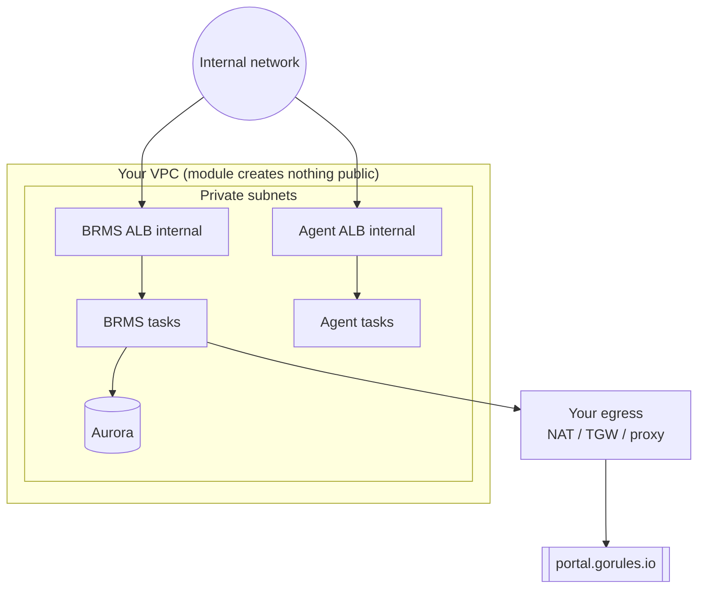

# GoRules Internal ALB Example

Deploys the complete GoRules stack with both load balancers in private subnets using the internal scheme. The ALBs are not reachable from the internet. Use this when company policy forbids internet-facing ALBs or public-subnet resources, or when the services are reached only from inside your network over VPN, Direct Connect, Transit Gateway or peering.

What gets deployed:

- **Load balancers**: internal scheme, in the private subnets. Reachable only from inside your network.
- **Database**: Aurora Serverless v2 PostgreSQL.
- **Storage**: S3 bucket for rules storage.
- **BRMS**: Business Rules Management System (UI and API).
- **Agent**: stateless rule evaluation API.

> [!IMPORTANT]
> **BRMS needs outbound internet**
>
> BRMS validates its license against `https://portal.gorules.io`, so the tasks must be able to reach it. A VPC with no egress cannot run BRMS. Provide egress through your network: a NAT gateway, a Transit Gateway to a shared egress VPC, a forward proxy, or on-prem breakout over Direct Connect or VPN. The Agent is self-contained and needs no egress.
>
> This is separate from the ALB being internal. The ALB has no public IPs either way. Egress is about the tasks reaching out, not about clients reaching in.

> [!WARNING]
> **BRMS requires HTTPS**
>
> Without HTTPS, BRMS shows a blank page. The frontend uses browser APIs (Web Crypto, Service Workers) that only work in a secure context. You must provide a certificate before you deploy. Finish the certificate step in the prerequisites first.

## Two modes

Set by `create_vpc`:

- **`create_vpc = false` (default)**: deploy into a VPC you already have. You pass the private subnets, and your network provides the egress. The module creates nothing in a public subnet. This is the path for a no-public-subnet policy.
- **`create_vpc = true`**: the module builds the VPC. Because BRMS needs egress, this mode adds a NAT gateway. The public subnets it creates host only the NAT. The ALBs stay internal. This does not give you a zero-public-subnet deployment, so under a strict policy use `create_vpc = false`.

A fully air-gapped VPC (`nat_gateway_mode = "none"`) suits an agent-only deployment, since the Agent needs no egress. It cannot run BRMS. See the [Internal Load Balancers](../../README.md#internal-load-balancers) section of the module README.

## Architecture (create_vpc = false)



## Prerequisites

Always:

- [ ] AWS CLI configured with credentials
- [ ] Terraform >= 1.14
- [ ] GoRules license key in Secrets Manager
- [ ] Internal domain for BRMS (for example `brms.internal.example.com`)
- [ ] ACM certificate ARN for that domain, in this region
- [ ] Egress for the tasks so BRMS can reach its license server

With `create_vpc = false`, also have an existing VPC that meets these:

| Requirement | Description |
|-------------|-------------|
| Private subnets | At least 2, in different AZs. The internal ALBs and the ECS tasks run here. |
| Public subnets | Not required |
| Egress | The tasks must reach the internet for the BRMS license check, and AWS APIs (ECR, logs, Secrets Manager). A NAT gateway covers both. Without a NAT, add VPC endpoints for ECR, logs, Secrets Manager and STS, plus a path to the internet for the license check. |
| DNS | `enable_dns_hostnames` and `enable_dns_support` both on |

## Step 1: Create the license secret

```bash
aws secretsmanager create-secret \
  --name gorules-license-key \
  --secret-string "YOUR_GORULES_LICENSE_KEY" \
  --region us-east-1
```

Note the ARN. You need it for `brms_license_key_secret_arn`.

## Step 2: Provide the TLS certificate

An internal ALB still terminates TLS, and BRMS still requires HTTPS. Provide an existing certificate ARN through `brms_certificate_arn`.

For an internal or private-only domain:

- Use AWS Private CA to issue a private certificate, or import your own into ACM. Internal clients trust it through your PKI.
- Route53 auto-issue is not used here. ACM validates over public DNS, so a private-only zone cannot be validated.

If a trusted edge such as CloudFront terminates HTTPS in front of the ALB, you can skip the ALB certificate and run it HTTP-only. See the [Internal Load Balancers](../../README.md#internal-load-balancers) section of the module README.

The certificate must be in the same region as the deployment.

```bash
aws acm list-certificates \
  --query 'CertificateSummaryList[*].[CertificateArn,DomainName]' \
  --output table \
  --region us-east-1
```

## Step 3: (create_vpc = false) Find your VPC details

```bash
aws ec2 describe-vpcs --query 'Vpcs[*].[VpcId,Tags[?Key==`Name`].Value|[0]]' --output table

aws ec2 describe-subnets \
  --filters "Name=vpc-id,Values=vpc-0123456789abcdef0" \
  --query 'Subnets[*].[SubnetId,AvailabilityZone,Tags[?Key==`Name`].Value|[0]]' \
  --output table
```

Confirm the private subnets have egress to the internet (for the license check) and to the AWS APIs.

## Step 4: Configure variables

```bash
cp terraform.tfvars.example terraform.tfvars
```

Edit `terraform.tfvars`. The default (existing VPC) needs at least:

```hcl
project_name = "gorules"
environment  = "prod"
region       = "us-east-1"

create_vpc         = false
vpc_id             = "vpc-0123456789abcdef0"
private_subnet_ids = ["subnet-private-1a", "subnet-private-1b"]

brms_license_key_secret_arn = "arn:aws:secretsmanager:us-east-1:123456789012:secret:gorules-license-key-AbCdEf"

brms_domain          = "brms.internal.example.com"
brms_certificate_arn = "arn:aws:acm:us-east-1:123456789012:certificate/..."

brms_allowed_cidr_blocks  = ["10.0.0.0/8"]
agent_allowed_cidr_blocks = ["10.0.0.0/8"]
```

To let the module build the VPC instead, set `create_vpc = true`. It then adds a NAT (`nat_gateway_mode` defaults to `single`) so BRMS has egress.

Both ALBs are set to the internal scheme in this example's `main.tf` (`alb_internal = true`), so you do not set that in tfvars.

## Step 5: Deploy

```bash
terraform init
terraform plan
terraform apply
```

> [!NOTE]
> This example fixes the internal scheme in `main.tf`. The scheme is immutable for an ALB's life: changing it later replaces the ALB and changes its DNS name, so do not switch a deployed ALB between internal and internet-facing.

## Step 6: Configure internal DNS

The internal ALB is not reachable from the internet, so make the service available inside your network:

1. Create a DNS record for the hostname (for example `brms.internal.example.com`) pointing at the ALB. Use a private hosted zone associated with the VPC or your corporate DNS. The targets are the `brms_alb_dns_name` and `agent_alb_dns_name` outputs.
2. Make sure clients can route to the private subnets over VPN, Direct Connect, Transit Gateway or peering.
3. Confirm `brms_allowed_cidr_blocks` and `agent_allowed_cidr_blocks` cover the client ranges.

For public access, keep the ALB internal and put an AWS managed edge in front of it, such as CloudFront with a VPC origin.

## Security Considerations

1. **Security groups**: the module creates security groups for the ALBs, ECS tasks and Aurora. ALB ingress is limited to `allowed_cidr_blocks`. Review them after deployment.
2. **Allowed ranges**: set `brms_allowed_cidr_blocks` and `agent_allowed_cidr_blocks` to your internal ranges, not `0.0.0.0/0`.
3. **Network ACLs**: make sure your NACLs allow internal traffic between subnets and from your client ranges.
4. **VPC flow logs**: consider enabling them if they are not on already.

## Outputs

| Output | Description |
|--------|-------------|
| `brms_url` | URL to access the BRMS UI |
| `brms_alb_dns_name` | Internal ALB DNS name (point your DNS record here) |
| `brms_alb_zone_id` | ALB zone ID (for Route53 alias) |
| `agent_url` | URL for the Agent API |
| `agent_alb_dns_name` | Internal Agent ALB DNS name |
| `agent_alb_zone_id` | Agent ALB zone ID |
| `vpc_id` | VPC ID (created or existing) |
| `private_subnet_ids` | Private subnet IDs (created or existing) |
| `s3_bucket_name` | S3 bucket name |
| `database_endpoint` | Aurora cluster endpoint |
| `ecs_cluster_name` | ECS cluster name |

## Troubleshooting

### BRMS shows a blank page

Almost always HTTPS is not configured correctly:

1. Verify you are using `https://`, not `http://`.
2. Check the certificate: `aws acm describe-certificate --certificate-arn YOUR_ARN`.
3. Verify your internal DNS resolves the hostname to the ALB private IPs: `nslookup brms.internal.example.com`.

### BRMS starts then fails, or reports a license error

BRMS cannot reach `https://portal.gorules.io`. Confirm the tasks have egress to the internet:

1. From the task subnets, there must be a route to the internet (NAT, Transit Gateway, or proxy).
2. If you use a proxy or firewall allowlist, allow `portal.gorules.io`.
3. The Agent does not need this, so an Agent that is healthy while BRMS is not points at egress.

### ECS tasks cannot pull the image

The image host is unreachable. With a NAT, Docker Hub works. With endpoints only and no internet path, mirror the image to ECR and set `brms_image` and `agent_image` to the ECR URI.

### Cannot reach the service

1. Confirm the hostname resolves to the ALB private IPs from a client inside the network.
2. Check the client source range is in `allowed_cidr_blocks`.
3. Confirm the client can route to the private subnets over your VPN, Direct Connect, Transit Gateway or peering.

### Database connection errors

Verify the Aurora security group allows traffic from the ECS task security group.

## Cleanup

```bash
terraform destroy
```

With `create_vpc = false` this leaves your existing VPC and subnets untouched.
