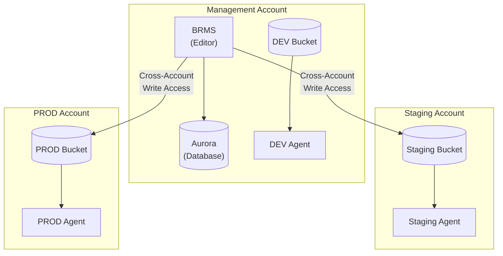

# Multi-Environment Cross-Account Deployment

This example demonstrates deploying GoRules across multiple AWS accounts with a centralized BRMS management interface.

## Architecture



## Components

| Account | Components | Purpose |
|---------|------------|---------|
| Management | BRMS + Aurora + DEV Agent + DEV Bucket | Rule editing, DEV environment |
| Staging | Agent + S3 Bucket | Staging rule evaluation |
| PROD | Agent + S3 Bucket | Production rule evaluation |

## Deployment Order

**Important:** Deploy in this order to establish cross-account trust:

1. **Staging Account** - Creates bucket with cross-account policy
2. **PROD Account** - Creates bucket with cross-account policy
3. **Management Account** - References Staging/PROD bucket ARNs

## Prerequisites

- AWS CLI configured with profiles for each account
- Terraform >= 1.14
- GoRules license key stored in Secrets Manager (management account)
- Route53 hosted zone or ACM certificates for HTTPS

## Quick Start

### Step 1: Deploy Staging Account

```bash
cd staging-account
cp terraform.tfvars.example terraform.tfvars
# Edit terraform.tfvars with your values

terraform init
terraform plan
terraform apply
```

Note the outputs:
- `s3_bucket_arn` - needed for management account
- `s3_bucket_name` - needed for management account

### Step 2: Deploy PROD Account

```bash
cd ../prod-account
cp terraform.tfvars.example terraform.tfvars
# Edit terraform.tfvars with your values

terraform init
terraform plan
terraform apply
```

Note the outputs:
- `s3_bucket_arn` - needed for management account
- `s3_bucket_name` - needed for management account

### Step 3: Deploy Management Account

```bash
cd ../management-account
cp terraform.tfvars.example terraform.tfvars
# Edit terraform.tfvars with:
# - Staging bucket ARN and name from Step 1
# - PROD bucket ARN and name from Step 2

terraform init
terraform plan
terraform apply
```

## Cross-Account Access

The cross-account access is established through:

1. **S3 Bucket Policy** (Staging/PROD accounts): Grants write access to the management account
2. **IAM Policy** (Management account): Grants BRMS task role permission to access external buckets

### Security Considerations

- Cross-account access requires HTTPS (`aws:SecureTransport` condition)
- Only specific S3 actions are permitted (no bucket deletion, no ACL changes)
- Access is scoped to specific bucket ARNs
- Consider using IAM role ARNs instead of account IDs for finer-grained control

## AI/LLM Configuration

The management account's BRMS deployment supports an optional AI assistant. To enable it, add the AI variables to your management account tfvars:

```hcl
brms_ai_enabled            = true
brms_ai_provider           = "anthropic"
brms_ai_model              = "claude-sonnet-4-6"
brms_ai_api_key_secret_arn = "arn:aws:secretsmanager:us-east-1:123456789012:secret:anthropic-api-key-AbCdEf"
```

See the [full-stack example](../full-stack/README.md#aillm-configuration-optional) for all available options.

## Customization

### Using IAM Role ARNs Instead of Account IDs

For more restrictive access, you can modify the staging/prod account modules to accept specific IAM role ARNs instead of account IDs. This requires updating the S3 bucket policy principal from `arn:aws:iam::ACCOUNT_ID:root` to the specific role ARN (e.g., `arn:aws:iam::111111111111:role/gorules-dev-brms-task`).

### Adding More Environments

To add a new environment (e.g., qa):

1. Copy `staging-account/` to `qa-account/`
2. Update environment name and variables
3. Deploy the new account
4. Add the bucket to management account's `external_buckets`

## Troubleshooting

### Access Denied Errors

1. Verify the bucket policy includes the correct account ID or role ARN
2. Check that the BRMS task role has the external buckets IAM policy attached
3. Ensure requests use HTTPS (required by bucket policy condition)

### Bucket Not Found

1. Verify the bucket ARN format: `arn:aws:s3:::bucket-name`
2. Check that the bucket exists and is in the expected region
3. Confirm the bucket name matches exactly (case-sensitive)
