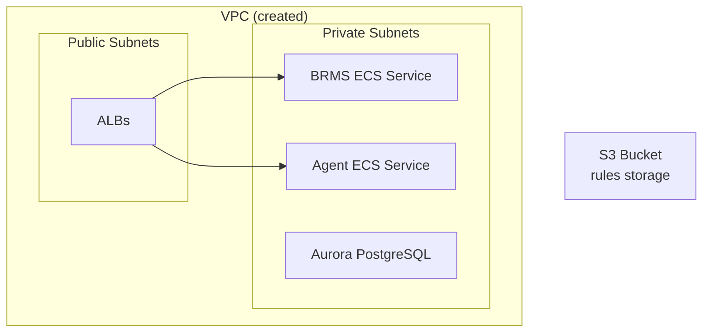
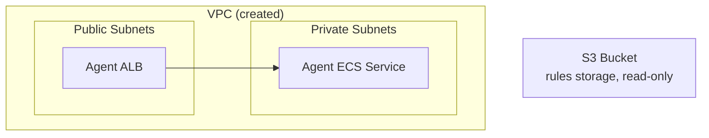
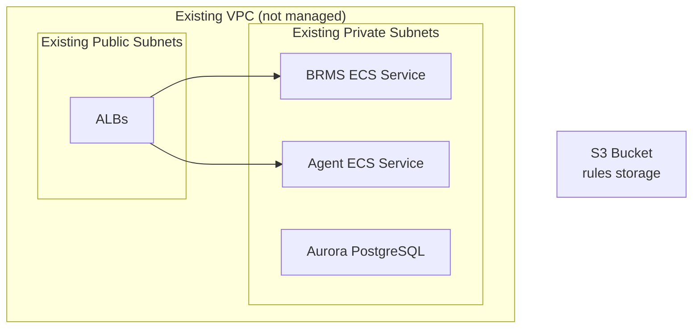
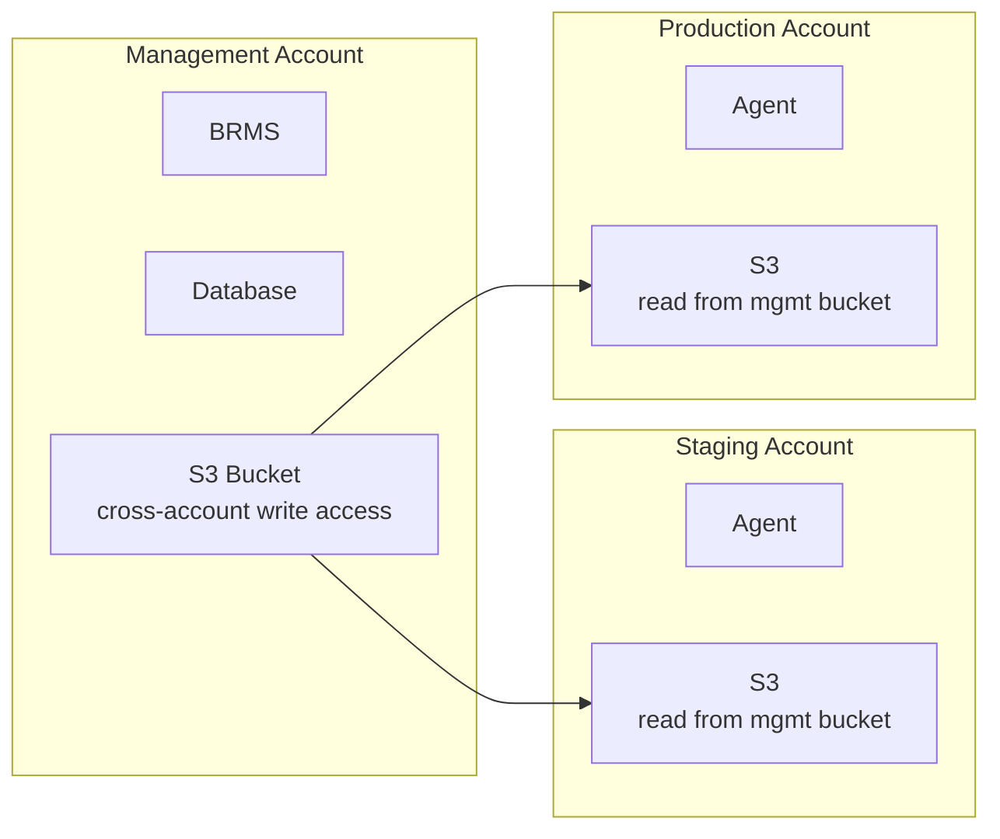

# Deployment Patterns

Four deployment topologies. Example code in `aws/examples/`.

## Pattern 1: Full Stack

**Directory**: `aws/examples/full-stack/`

Deploys everything: VPC + Database + Storage + BRMS + Agent



### When to use
- Single-account deployments
- Complete self-contained environments
- Development and testing

### Key configuration
- `vpc.create = true`
- `storage != null`
- `database != null` (provide min/max capacity)
- `brms != null` (provide cpu, memory, domain)
- `agent != null` (provide cpu, memory)

## Pattern 2: Agent Only

**Directory**: `aws/examples/agent-only/`

Stateless rule execution — no database, no BRMS.



### When to use
- Dedicated rule execution environments
- High-throughput stateless processing
- Part of [multi-environment](#pattern-4-multi-environment) setup

### Key configuration
- `database = null`
- `brms = null`
- `agent != null`
- Agent gets read-only S3 access via [IAM Architecture](iam-architecture.md)

## Pattern 3: Existing VPC

**Directory**: `aws/examples/existing-vpc/`

Integrate with an already-provisioned VPC.



### When to use
- Enterprise environments with centralized networking
- Shared VPCs managed by a platform team
- Compliance requirements for network topology

### Key configuration
```hcl
vpc = {
  create             = false
  id                 = "vpc-0abc123..."
  private_subnet_ids = ["subnet-0aaa...", "subnet-0bbb..."]
  public_subnet_ids  = ["subnet-0ccc...", "subnet-0ddd..."]
}
```

Validation in [Root Module](root-module.md) ensures id + both subnet lists are provided.

## Pattern 4: Multi-Environment

**Directory**: `aws/examples/multi-environment/`

Cross-account deployment with centralized BRMS and distributed Agents.



### Deployment Order (Critical)

1. **Staging** first — creates Agent infrastructure
2. **Production** second — creates Agent infrastructure
3. **Management** last — creates BRMS + DB + S3 with cross-account policies

This order matters because cross-account S3 policies must reference existing account IDs/roles.

### Cross-Account S3

Management account S3 bucket grants access to staging/prod:

```hcl
storage = {
  cross_account_write_principals = [
    "111111111111",  # Staging account
    "222222222222"   # Production account
  ]
}
```

See [Storage Module](storage-module.md) for how the bucket policy is constructed.

### Agents read from management S3

```hcl
# In staging/prod accounts:
storage = {
  create_bucket        = false
  existing_bucket_arn  = "arn:aws:s3:::gorules-mgmt-rules-abc123"
  existing_bucket_name = "gorules-mgmt-rules-abc123"
}
```

## Auth Mode Combinations

Different [security postures](security-architecture.md) are possible:

| Component | Mode 1 (Simple) | Mode 2 (IAM-Native) |
|-----------|-----------------|---------------------|
| Database | auth = "secrets" | auth = "iam" |
| Storage | auth = "iam" | auth = "iam" |
| BRMS Secrets | type = "env" | type = "aws-kms" |

See [Secrets Management](secrets-management.md) for details on each mode.
