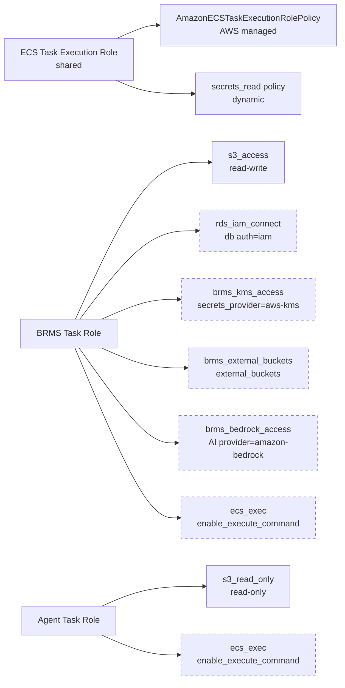
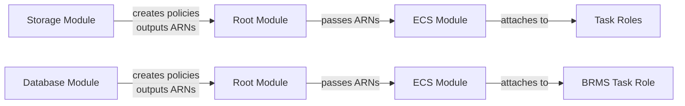

# IAM Architecture

Separate roles per service, least-privilege. Defined in `iam.tf` within the [ECS Module](ecs-module.md).

## Role Architecture



## Task Execution Role

Shared by both BRMS and Agent. Handles image pulling and secret retrieval.

### AWS Managed Policy

`AmazonECSTaskExecutionRolePolicy` — allows:
- ECR image pull
- CloudWatch log creation

### Secrets Read Policy (Dynamic)

Dynamically constructed based on which components are enabled:

| Secret | Service | Condition |
|--------|---------|----------|
| License key | BRMS | Always (BRMS enabled) |
| Cookie secret | BRMS | Always (BRMS enabled) |
| Secrets master key | BRMS | secrets_provider = "env" |
| AI API key | BRMS | AI enabled + API key provided |
| Custom secrets (brms.secrets) | BRMS | User-provided secrets |
| Custom secrets (agent.secrets) | Agent | User-provided secrets |
| Database credentials | BRMS | db auth = "secrets" |
| Storage credentials | BRMS/Agent | storage auth = "secrets" |

## BRMS Task Role

### S3 Read-Write Access

From [Storage Module](storage-module.md)'s `s3_access` policy:
- `s3:ListBucket`, `s3:GetBucketLocation`
- `s3:GetObject`, `s3:PutObject`, `s3:DeleteObject` + versions

### RDS IAM Connect (conditional)

Created by the [Database Module](database-module.md) when `database.auth = "iam"`. Allows BRMS to authenticate to Aurora using temporary IAM credentials instead of a password:

```hcl
data "aws_iam_policy_document" "rds_iam_connect" {
  statement {
    effect    = "Allow"
    actions   = ["rds-db:connect"]
    resources = [
      "arn:aws:rds-db:${data.aws_region.current.name}:${data.aws_caller_identity.current.account_id}:dbuser:${aws_rds_cluster.this.cluster_resource_id}/${var.iam_username}"
    ]
  }
}
```

### KMS Access (conditional)

When `brms.secrets_provider.type = "aws-kms"`, grants the BRMS task role permission to use the customer-managed KMS key for encrypting and decrypting internal secrets:

```hcl
data "aws_iam_policy_document" "brms_kms_access" {
  statement {
    effect = "Allow"
    actions = [
      "kms:Encrypt",
      "kms:Decrypt",
      "kms:GenerateDataKey",
      "kms:GenerateDataKeyWithoutPlaintext",
      "kms:DescribeKey",
    ]
    resources = [local.brms_kms_key_arn]
  }
}
```

See [Secrets Management](secrets-management.md) for the KMS setup.

### External Buckets (conditional)

When `brms.external_buckets` is provided (for [multi-account deployments](deployment-patterns.md)), grants BRMS access to S3 buckets in other AWS accounts:

```hcl
data "aws_iam_policy_document" "brms_external_buckets" {
  dynamic "statement" {
    for_each = var.brms_external_buckets
    content {
      effect  = "Allow"
      actions = ["s3:ListBucket", "s3:GetBucketLocation"]
      resources = [statement.value.arn]
    }
  }

  dynamic "statement" {
    for_each = var.brms_external_buckets
    content {
      effect = "Allow"
      actions = [
        "s3:GetObject",
        "s3:PutObject",
        "s3:DeleteObject",
      ]
      resources = ["${statement.value.arn}/*"]
    }
  }
}
```

### Bedrock AI Access (conditional)

When BRMS AI provider = `amazon-bedrock`, grants access to invoke foundation models. No API key needed — IAM handles authentication:

```hcl
data "aws_iam_policy_document" "brms_bedrock_access" {
  statement {
    effect = "Allow"
    actions = [
      "bedrock:InvokeModel",
      "bedrock:InvokeModelWithResponseStream",
    ]
    resources = ["arn:aws:bedrock:*::foundation-model/*"]
  }
}
```

See [AI LLM Configuration](ai-llm-configuration.md) for AI setup.

### ECS Exec (conditional)

When `enable_execute_command = true`, grants SSM permissions for interactive container shell access:

```hcl
data "aws_iam_policy_document" "ecs_exec" {
  statement {
    effect = "Allow"
    actions = [
      "ssmmessages:CreateControlChannel",
      "ssmmessages:CreateDataChannel",
      "ssmmessages:OpenControlChannel",
      "ssmmessages:OpenDataChannel",
    ]
    resources = ["*"]
  }
}
```

## Agent Task Role

Much simpler than BRMS:

### S3 Read-Only Access

From [Storage Module](storage-module.md)'s `s3_read_only` policy:
- `s3:ListBucket`, `s3:GetBucketLocation`
- `s3:GetObject`, `s3:GetObjectVersion`

No write access — Agent only reads rules, never modifies them.

## Lambda Execution Role

For the [Database Module](database-module.md)'s IAM user setup Lambda:
- `AWSLambdaVPCAccessExecutionRole` (AWS managed)
- `secretsmanager:GetSecretValue` on database credentials
- `rds-db:connect` for IAM authentication

## Storage IAM User (conditional)

When `storage.auth = "secrets"`, an IAM user is created:
- Full S3 access policy attached
- Access keys stored in Secrets Manager
- See [Storage Module](storage-module.md) for details

## Policy Attachment Flow


