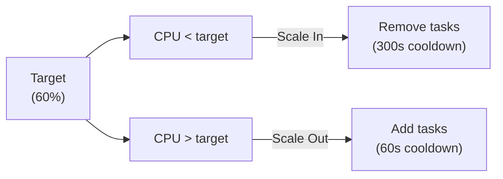

# Monitoring and Autoscaling

CloudWatch alarms and auto scaling for both ECS services.

## CloudWatch Alarms (`monitoring.tf`)

Conditional: only created when the respective service (BRMS/Agent) is enabled. Alarm actions send to optional SNS topic.

### Per-Service Alarms

| Alarm | Metric | Namespace | Statistic | Threshold | Evaluation |
|-------|--------|-----------|-----------|-----------|------------|
| CPU High | CPUUtilization | AWS/ECS | Average | > 80% | 3 × 60s |
| Memory High | MemoryUtilization | AWS/ECS | Average | > 80% | 3 × 60s |
| ALB 5xx Errors | HTTPCode_Target_5XX_Count | AWS/ApplicationELB | Sum | > 10/min | 2 × 60s |
| Unhealthy Targets | UnHealthyHostCount | AWS/ApplicationELB | Average | > 0 | 2 × 60s |

All alarms use `GreaterThanThreshold` comparison and `treat_missing_data = "notBreaching"`.

### Alarm Actions

```hcl
alarm_actions = var.alarm_sns_topic_arn != null ? [var.alarm_sns_topic_arn] : []
```

If no SNS topic provided, alarms still trigger (visible in CloudWatch console) but send no notifications.

### Container Insights

Enabled on the ECS cluster:

```hcl
resource "aws_ecs_cluster" "this" {
  setting {
    name  = "containerInsights"
    value = "enabled"
  }
}
```

Provides per-container CPU, memory, network, and storage metrics.

## Application Auto Scaling (`autoscaling.tf`)

Both BRMS and Agent use CPU-based target tracking scaling.

### Configuration

| Setting | BRMS | Agent |
|---------|------|-------|
| Min capacity | `brms.min_count` | `agent.min_count` |
| Max capacity | `brms.max_count` | `agent.max_count` |
| Target CPU | `brms.cpu_target` (default 60%) | `agent.cpu_target` (default 60%) |
| Scale-out cooldown | 60 seconds | 60 seconds |
| Scale-in cooldown | 300 seconds | 300 seconds |

### How It Works



### Resources

| Resource | Purpose |
|----------|---------|
| `aws_appautoscaling_target` | Registers ECS service as scalable |
| `aws_appautoscaling_policy` | CPU target tracking policy |

### Task Definition Lifecycle

The ECS service ignores `desired_count` after creation:

```hcl
lifecycle {
  ignore_changes = [desired_count]
}
```

This prevents Terraform from fighting with the autoscaler.

## Log Configuration

Each service gets its own CloudWatch log group:

| Service | Log Group | Retention |
|---------|-----------|----------|
| BRMS | `/ecs/{name_prefix}/brms` | 30 days (configurable) |
| Agent | `/ecs/{name_prefix}/agent` | 30 days (configurable) |
| Database | `/aws/rds/cluster/{name}/postgresql` | 30 days |
| Lambda (IAM auth) | `/aws/lambda/{name}` | 30 days |

Log driver: `awslogs` with auto-stream prefix per container.

## Deployment Health

ECS deployment circuit breaker provides automatic rollback:

```hcl
deployment_circuit_breaker {
  enable   = true
  rollback = true
}

deployment_maximum_percent         = 200
deployment_minimum_healthy_percent = 100
```

This means: during deployments, new tasks launch first (up to 200%), old tasks drain only after new ones are healthy. If new tasks fail, automatic rollback.

### Health Check Settings

| Setting | BRMS Default | Agent Default |
|---------|-------------|---------------|
| Path | `/api/health` | `/api/health` |
| Interval | 10s | 10s |
| Timeout | 5s | 5s |
| Healthy threshold | 2 | 2 |
| Unhealthy threshold | 3 | 3 |
| Grace period | 60s | 60s |
| Deregistration delay | 30s | 30s |
