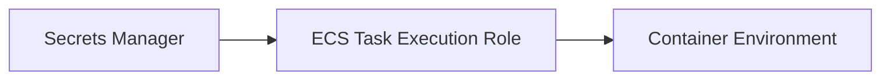
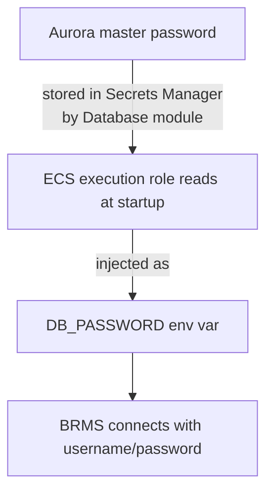
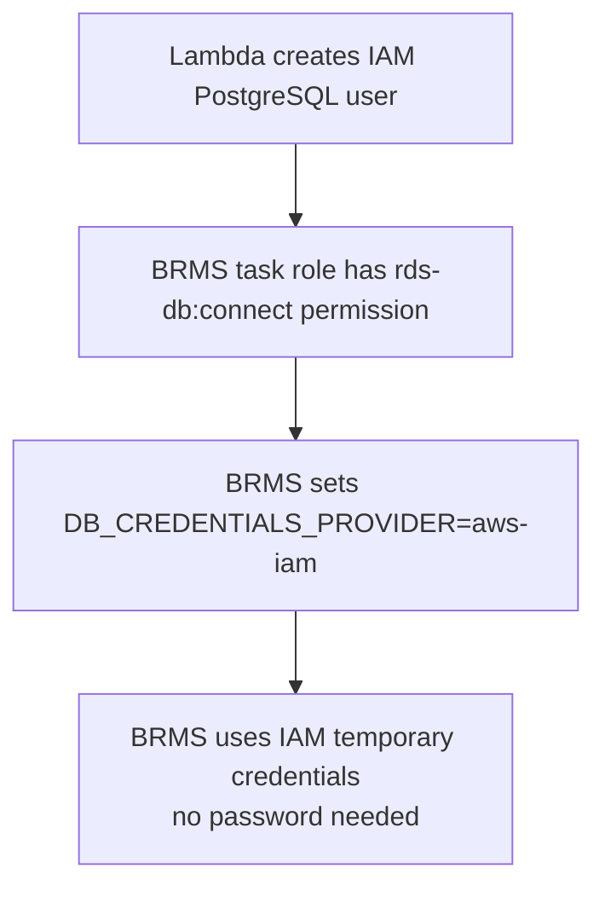

# Secrets Management

All secrets go through AWS Secrets Manager. KMS encryption is optional.

## Secrets Inventory

All secrets stored in AWS Secrets Manager — never in task definitions or Terraform state.

| Secret | Created By | Purpose | Conditional |
|--------|-----------|---------|-------------|
| Database master credentials | [Database Module](database-module.md) | Aurora admin login | Always (if DB enabled) |
| S3 access keys | [Storage Module](storage-module.md) | IAM user credentials | storage.auth = "secrets" |
| BRMS license key | User-provided | GoRules license | Always (BRMS enabled) |
| Cookie secret | [ECS Module](ecs-module.md) | Session management | Always (BRMS enabled) |
| Secrets master key | [ECS Module](ecs-module.md) | BRMS internal encryption | secrets_provider = "env" |
| AI API key | User-provided | LLM provider authentication | AI enabled (not bedrock) |

## BRMS Secrets Encryption Provider

BRMS encrypts its internal secrets (stored in the database) using one of two providers:

### ENV Provider (default: `type = "env"`)

- Auto-generates a `SECRETS_MASTER_KEY` (random, 64 chars by default, min 32)
- Stored in Secrets Manager
- BRMS reads it at startup and uses it for AES encryption
- Simpler setup, key lives in Secrets Manager

```hcl
brms = {
  secrets_provider = {
    type              = "env"
    master_key_length = 64  # min 32
  }
}
```

### AWS-KMS Provider (`type = "aws-kms"`)

- Creates (or uses existing) customer-managed KMS key
- BRMS calls KMS API for encrypt/decrypt operations
- Better audit trail via CloudTrail
- Key rotation enabled automatically

```hcl
brms = {
  secrets_provider = {
    type                = "aws-kms"
    create_kms_key      = true
    kms_key_alias       = "brms-secrets"
    kms_deletion_window = 30  # 7-30 days
  }
}
```

#### KMS Resources Created

| Resource | Purpose |
|----------|---------|
| `aws_kms_key.brms_secrets` | Customer-managed encryption key |
| `aws_kms_alias.brms_secrets` | Optional human-readable alias |

KMS access policy attached to BRMS task role — see [IAM Architecture](iam-architecture.md).

### Using Existing KMS Key

```hcl
brms = {
  secrets_provider = {
    type           = "aws-kms"
    create_kms_key = false
    kms_key_arn    = "arn:aws:kms:us-east-1:123456789012:key/abc-123"
  }
}
```

## How Secrets Reach ECS Tasks

ECS uses the `secrets` block in container definitions to inject Secrets Manager values as environment variables at runtime:



1. Task definition references secret ARNs
2. ECS agent (via execution role) calls `secretsmanager:GetSecretValue`
3. Values injected as env vars at container start

The execution role gets a dynamically-built `secrets_read` policy — see [IAM Architecture](iam-architecture.md).

## Database Credentials Flow

### Secrets Auth (default)



### IAM Auth



See [Database Module](database-module.md) for the Lambda setup and [IAM Architecture](iam-architecture.md) for the connect policy.

## Storage Credentials Flow

### IAM Auth (default)

No credentials needed — S3 access via task role. See [IAM Architecture](iam-architecture.md).

### Secrets Auth

IAM user with access keys stored in Secrets Manager:

```json
{
  "access_key_id": "AKIA...",
  "secret_access_key": "...",
  "bucket_name": "gorules-prod-rules-abc123",
  "region": "us-east-1"
}
```

See [Storage Module](storage-module.md) for details.

## Known Issues

- `prevent_destroy = false` on KMS keys and secrets master keys despite "DO NOT DELETE" comments in the code
- Secrets are in Terraform state (encrypted values visible in `terraform.tfstate`)
- No automatic secret rotation configured
