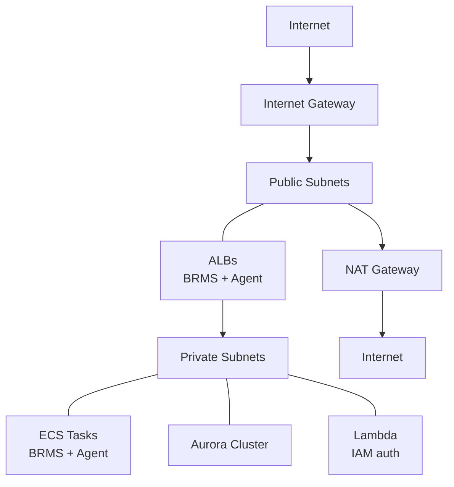

# Security Architecture

Network isolation, encryption, security groups, and TLS across all modules.

## Network Isolation Model

Public/private subnet pattern:



- **Public subnets**: Only ALBs are internet-facing
- **Private subnets**: All compute (ECS tasks, Lambda) and data (Aurora) in private subnets
- **NAT Gateway**: Provides internet egress for private resources
- **VPC Endpoints**: Optional, reduce NAT traffic. See [VPC Module](vpc-module.md)

## Security Group Architecture

Four layers of security groups, each allowing only necessary traffic:

### Layer 1: ALB Security Groups

| Service | Ingress | Egress |
|---------|---------|--------|
| BRMS ALB | HTTP/HTTPS from `allowed_cidr_blocks` | Container port to BRMS Task SG |
| Agent ALB | HTTP/HTTPS from `allowed_cidr_blocks` | Container port to Agent Task SG |

### Layer 2: Task Security Groups

| Service | Ingress | Egress |
|---------|---------|--------|
| BRMS Tasks | Container port from BRMS ALB SG | 0.0.0.0/0 (all) |
| Agent Tasks | Container port from Agent ALB SG | 0.0.0.0/0 (all) |

### Layer 3: Database Security Group

| Ingress | Source |
|---------|--------|
| Port 5432 | BRMS Task SG (via [Root Module](root-module.md) cross-module rule) |
| Port 5432 | Lambda SG (if IAM auth enabled) |

### Layer 4: VPC Endpoints Security Group

| Ingress | Source |
|---------|--------|
| Port 443 (HTTPS) | VPC CIDR block |

### Cross-Module SG Wiring

The [Root Module](root-module.md) creates the critical SG rule connecting BRMS to the database:

```hcl
resource "aws_security_group_rule" "database_from_brms" {
  count                    = local.create_brms && local.create_database ? 1 : 0
  type                     = "ingress"
  from_port                = 5432
  to_port                  = 5432
  protocol                 = "tcp"
  source_security_group_id = module.ecs[0].brms_tasks_security_group_id
  security_group_id        = module.database[0].security_group_id
}
```

This pattern uses `source_security_group_id` (not CIDRs) for internal traffic.

## Encryption In Transit

| Connection | Encryption | Mechanism |
|------------|------------|----------|
| Client → ALB | TLS 1.3 | ALB HTTPS listener (`ELBSecurityPolicy-TLS13-1-2-2021-06`) |
| ALB → ECS Tasks | HTTP | Within VPC, SG-restricted |
| BRMS → Aurora | SSL | `rds.force_ssl = 1` parameter, RDS CA bundle |
| ECS → S3 | HTTPS | Bucket policy denies insecure transport |
| ECS → Secrets Manager | HTTPS | AWS API default |

### BRMS HTTPS Requirement

BRMS requires HTTPS — it uses Web Crypto and Service Workers that only work in secure contexts. Enforced at variable validation level: must provide `route53_zone_id` or `certificate_arn`. See [Certificates and DNS](certificates-and-dns.md).

### Database SSL

The [ECS Module](ecs-module.md) fetches the RDS CA bundle and passes it as `DB_SSL_CA` (base64 encoded) to the BRMS container. If the user sets `ssl_verify = false`, it passes `DB_REJECT_UNAUTHORIZED=false` instead.

## Encryption At Rest

| Resource | Encryption |
|----------|------------|
| Aurora cluster | Storage encrypted (AWS-managed key) |
| S3 bucket | AES256 server-side encryption + bucket key |
| Secrets Manager | AWS-managed or customer KMS key |
| CloudWatch Logs | AWS-managed encryption |
| KMS key (optional) | For BRMS secrets encryption provider |

## Secret Protection

All secrets managed via AWS Secrets Manager — never in task definitions or Terraform state:

- Database master password
- S3 access keys (secrets auth mode)
- BRMS license key
- Cookie secret (auto-generated)
- Secrets master key (auto-generated)
- AI API keys

## IAM Least Privilege

Separate task roles per service with minimal permissions:
- BRMS: S3 read-write + database access + optional KMS/Bedrock
- Agent: S3 read-only only

## Known Security Considerations

1. **ECS task egress is 0.0.0.0/0** — wide open outbound. Can be tightened with [VPC endpoints](vpc-module.md)
2. **`prevent_destroy = false`** on KMS keys and secrets master keys despite "DO NOT DELETE" comments
3. **RDS CA bundle HTTP fetch** is unconditional (potential supply chain consideration)
4. **Provider version constraints are floor-only** (`>= 6.0`) — no upper bound protection
