# Variable System

How config flows from [Root Module](root-module.md) to child modules.

## Design Principles

1. **Structured objects** — Top-level variables are typed `object({})` with `optional()` attributes and defaults
2. **Null-disabling** — Setting a component to `null` disables it entirely
3. **Extensive validation** — Regex patterns, numeric ranges, cross-field checks, Fargate CPU/memory matrix
4. **Sensible defaults** — Most attributes have defaults; only a few are truly required

## Variable Hierarchy

### Required (no defaults)

| Variable | Type | Validation |
|----------|------|------------|
| `project_name` | string | 2-32 chars, lowercase alphanumeric + hyphens |
| `environment` | string | 2-16 chars, same pattern |
| `region` | string | AWS region format (e.g. `us-east-1`) |

### Component Variables (nullable objects)

| Variable | Default | Controls |
|----------|---------|----------|
| `vpc` | `{ create = true }` | [VPC Module](vpc-module.md) |
| `storage` | `{ create_bucket = true, auth = "iam" }` | [Storage Module](storage-module.md) |
| `database` | Must provide min/max capacity | [Database Module](database-module.md) |
| `brms` | Must provide cpu, memory, domain, etc. | BRMS in [ECS Module](ecs-module.md) |
| `agent` | Must provide cpu, memory, etc. | Agent in [ECS Module](ecs-module.md) |

## Data Flow: Root → Child Modules

```mermaid
flowchart TD
    subgraph VPC Flow
        varVPC[var.vpc] --> modVPC["module.vpc[0]"]
        modVPC -->|"outputs: vpc_id, subnet_ids"| localsVPC["locals.tf\nvpc_id, private_subnet_ids,\npublic_subnet_ids"]
        localsVPC --> modDB["module.database[0]\nvpc_id, private_subnet_ids"]
        localsVPC --> modECS1["module.ecs[0]\nvpc_id, all subnet_ids"]
    end

    subgraph Storage Flow
        varStorage[var.storage] --> modStorage["module.storage[0]"]
        modStorage -->|"outputs: bucket_name,\niam_policy_arns"| localsStorage["locals.tf\nbucket_name, bucket_arn"]
        localsStorage --> modECS2["module.ecs[0]\nstorage config + IAM policies"]
    end

    subgraph Database Flow
        varDB[var.database] --> modDB2["module.database[0]"]
        modDB2 -->|"outputs: endpoint,\ncredentials_secret_arn"| rootMain["root main.tf"]
        rootMain --> modECS3["module.ecs[0]\ndatabase config, BRMS only"]
    end

    subgraph Services
        varBRMS[var.brms / var.agent] --> modECS4["module.ecs[0]\nfull config objects"]
    end
```



## Locals as Routing Layer (`locals.tf`)

The `locals.tf` file acts as a routing layer, resolving whether to use created or existing resources:

```hcl
# VPC routing
local.vpc_id = local.create_vpc ? module.vpc[0].vpc_id : var.vpc.id
local.private_subnet_ids = local.create_vpc ? module.vpc[0].private_subnet_ids : var.vpc.private_subnet_ids

# Storage routing
local.bucket_name = local.create_bucket ? module.storage[0].bucket_name : var.storage.existing_bucket_name

# AZ selection
local.availability_zones = length(var.vpc.availability_zones) > 0 ? var.vpc.availability_zones : slice(data.aws_availability_zones.available.names, 0, 2)
```

## Validation Patterns

### Regex Validation

```hcl
validation {
  condition     = can(regex("^[a-z][a-z0-9-]*[a-z0-9]$", var.project_name))
  error_message = "Must be lowercase alphanumeric with hyphens."
}
```

### Fargate CPU/Memory Matrix

Complex cross-field validation ensuring valid Fargate combinations:

| CPU (units) | Memory Range (MiB) |
|-------------|--------------------|
| 256 | 512, 1024, 2048 |
| 512 | 1024 - 4096 |
| 1024 | 2048 - 8192 |
| 2048 | 4096 - 16384 |
| 4096 | 8192 - 30720 |
| 8192 | 16384 - 61440 |
| 16384 | 32768 - 122880 |

### Cross-Field Validation

- `min_count <= max_count`
- Auto-pause requires `min_capacity = 0`
- HTTPS: must have `route53_zone_id` OR `certificate_arn`
- Azure OpenAI requires `azure_resource_name`
- AI API key required unless provider is `amazon-bedrock`

## Naming Convention

`name_prefix = "{project_name}-{environment}"`

All resources follow: `{project_name}-{environment}-{component}`
Examples: `gorules-prod-brms-alb`, `gorules-staging-aurora-sg`

## Tagging Strategy

All resources get merged tags:

```hcl
default_tags = {
  Project     = var.project_name
  Environment = var.environment
  ManagedBy   = "terraform"
}
# Each child module adds: Module = "<module_name>"
# Merged with user-provided var.tags
```
